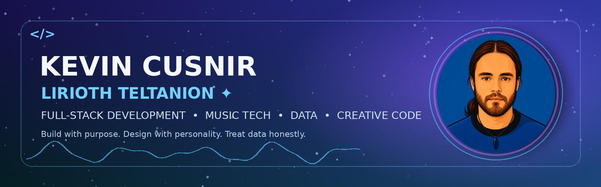
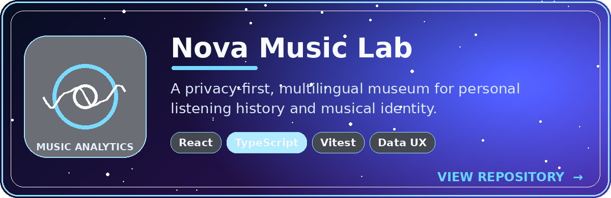
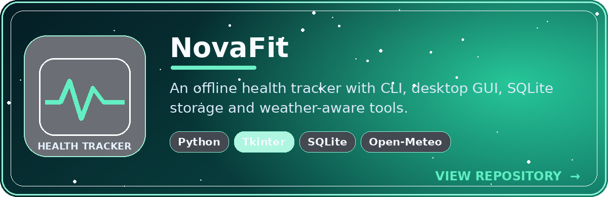
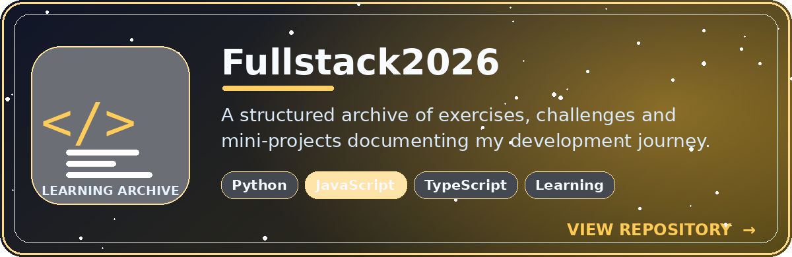
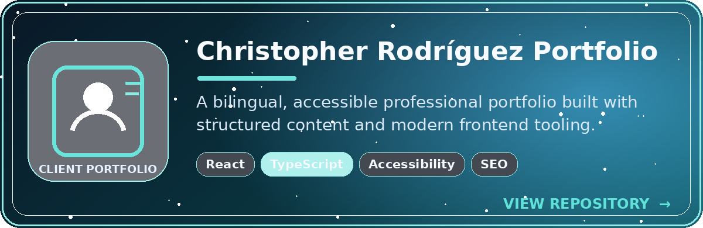
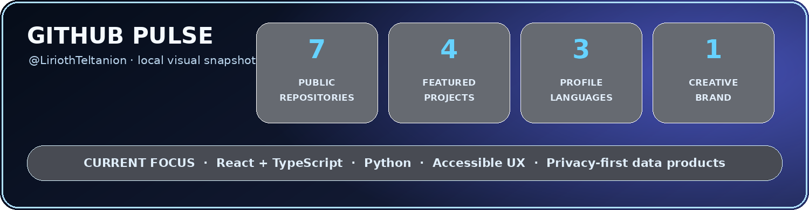

# Kevin Cusnir · Lirioth Teltanion ✨

### Full-Stack Developer · Creative Technologist · Data-Driven Builder

**Code with purpose. Design with personality. Data with honesty.** 💙

  
  
  

  
  
  

  
  
  

---

## ✨ Portfolio snapshot

<table>
<tr>
<td width="33%" align="center">

### 🎧 Music + Data

Privacy-first analytics, interactive storytelling, multilingual UX and generative visual identity.

</td>
<td width="33%" align="center">

### 💻 Engineering

React, TypeScript, Python, SQL, testing, CI, documentation and accessible interfaces.

</td>
<td width="33%" align="center">

### 🧙‍♂️ Creative Code

Technology shaped by music, art, retro games, visual systems and human-centered design.

</td>
</tr>
</table>

 

---

## 🌐 Read my profile

<strong>🌐 English — open full profile</strong>

 

## 👋 About me

I am **Kevin Cusnir**, a full-stack developer based in Israel. **Lirioth Teltanion** is my creative identity: the name I use for imaginative projects, gaming, storytelling, music and experimental technology.

I trained in full-stack development at **Developers Institute in 2025**, and I now focus on turning ambitious ideas and complex data into software that feels clear, useful and alive.

- 💻 I build with **React, TypeScript, JavaScript, Python, SQL and Node.js**.
- 🎨 I enjoy combining engineering with visual identity, storytelling and thoughtful UX.
- ♿ I care about accessibility, privacy, documentation, maintainable structure and honest data.
- 🌍 I communicate in **English, Spanish and Hebrew**.
- 🎧 My interests include music technology, data tools, health tech, retro games, AI-assisted creativity, hardware and automation.

> **My direction:** fewer throwaway demos, more complete products with a strong idea, clear architecture and memorable presentation. 🚀

## 🔭 What I am working on

- 🎧 Expanding **Nova Music Lab**, my multilingual music-analytics experience.
- 🧱 Strengthening full-stack architecture with real backends, PostgreSQL, authentication and Docker.
- 🧪 Improving testing, CI/CD, accessibility and deployment discipline.
- 🎹 Exploring software that connects music, personal data, creative identity and digital art.
- 💼 Preparing a focused portfolio for junior full-stack and frontend opportunities.

## 🚀 Featured projects

### 🎧 Nova Music Lab

A privacy-first music analytics museum that turns listening-history exports into interactive statistics, personal records, timelines, emotional maps, achievements, cultural insights and a generative artist identity.

**What makes it special**

- 📥 Imports Last.fm, Spotify, Apple Music, ListenBrainz and YouTube history.
- 🔒 Processes user files locally in the browser.
- 🌐 Supports English, Spanish and Hebrew, including RTL behavior.
- 📊 Uses data-quality audits, media-link validation and bundle-size budgets.
- 🧪 Includes automated tests, CI and GitHub Pages deployment.
- 🎭 Combines analytical depth with a visual museum-style experience.

**Stack:** React · TypeScript · Vite · Tailwind CSS · Vitest · Recharts · Framer Motion

[🌐 Live demo](https://liriothteltanion.github.io/NovaMusicLab/) ·
[💻 Source code](https://github.com/LiriothTeltanion/NovaMusicLab)

---

### 💙 NovaFit

An offline health tracker with command-line and desktop interfaces for recording activity, hydration, calories, mood, goals and trends.

**Highlights**

- 🖥️ CLI and Tkinter GUI.
- 💾 SQLite local storage.
- 📤 JSON and CSV import/export.
- 🌤️ Weather integration through Open-Meteo.
- 🎲 Demo-data generation with Faker.
- 🛡️ Input validation, clear feedback and local-first design.

**Stack:** Python · Tkinter · SQLite · Requests · Faker

[💻 Source code](https://github.com/LiriothTeltanion/NovaFit)

---

### 📚 Fullstack2026

A structured learning archive containing exercises, daily challenges and mini-projects across Python, object-oriented programming, JavaScript, the DOM, asynchronous programming and TypeScript.

It documents my progression from fundamentals to more complete applications, while preserving the work that built my technical foundation.

[📂 Explore the learning archive](https://github.com/LiriothTeltanion/Fullstack2026)

---

### 👨‍🏫 Christopher Rodríguez — Portfolio & Online CV

A bilingual React and TypeScript portfolio created around a real professional profile, with structured content, accessibility, theme controls, international experience, SEO data and GitHub Pages deployment.

**Stack:** React · TypeScript · Vite · Tailwind CSS · Framer Motion

[💻 Source code](https://github.com/LiriothTeltanion/ChristopherRodriguezCVOnline)

## 🧪 Earlier experiments and learning highlights

- 🏃‍♂️ **Weather-Aware Run Planner** — planned runs using hourly weather data, local caching and SQLite sessions.
- 🧬 **DNA Evolution OOP Kata** — Gene, Chromosome and DNA classes with mutation and simulation logic.
- 🐉 **Sinaloa Dragon** — a small Phaser side-scroller and retro-game experiment.
- 🔐 **PassKeep** — an offline password-manager prototype kept private while its security model and implementation are hardened.

These projects are part of my evolution. I keep the strongest work visible while using earlier experiments to preserve lessons, patterns and ideas worth revisiting.

## 🧰 Skills and tools

**Languages:** Python · TypeScript · JavaScript · SQL  
**Frontend:** React · HTML5 · CSS3 · Tailwind CSS · Vite  
**Backend:** Node.js · Express fundamentals · Python application logic · REST APIs  
**Data:** SQLite · JSON · CSV · data transformation and validation  
**Desktop UI:** Tkinter / ttk  
**Testing and quality:** Vitest · unit testing · GitHub Actions · linting · data audits  
**Utilities:** argparse · pathlib · logging · Faker · matplotlib · PowerShell  
**Workflow:** Git · GitHub · Conventional Commits · README-first documentation

## 🛠️ How I write code

- 📝 Technical comments and documentation are primarily written in **English**.
- 🐍 Python work follows PEP 8, type hints, clear docstrings, `pathlib`, logging and useful error messages.
- ⌨️ CLIs include understandable commands, `--help`, validation and concise success or failure feedback.
- 🖼️ Desktop interfaces use sensible spacing, accessible defaults and theme-aware presentation.
- 🧪 I prefer reproducible validation: tests, audits, build checks and documented limitations.
- 🔍 I do not want polished-looking fake data; missing information should be shown honestly.
- 📚 A strong README is part of the product, not an afterthought.

## 🤝 Contact

I am open to junior full-stack and frontend roles, collaborations and meaningful creative-technology projects.

- 💼 [LinkedIn — Kevin Cusnir](https://www.linkedin.com/in/kevin-cusnir/)
- 🐙 [GitHub — LiriothTeltanion](https://github.com/LiriothTeltanion)
- ✉️ `kevincusnir [at] gmail [dot] com`

<a href="#top">⬆️ Back to top</a>

<strong>🌐 Español — abrir el perfil completo</strong>

 

## 👋 Sobre mí

Soy **Kevin Cusnir**, desarrollador full-stack residente en Israel. **Lirioth Teltanion** es mi identidad creativa: el nombre que utilizo para proyectos imaginativos, videojuegos, storytelling, música y experimentación tecnológica.

Me formé en desarrollo full-stack en **Developers Institute durante 2025**, y actualmente me concentro en transformar ideas ambiciosas y datos complejos en software claro, útil y con vida propia.

- 💻 Desarrollo con **React, TypeScript, JavaScript, Python, SQL y Node.js**.
- 🎨 Me gusta unir ingeniería, identidad visual, narrativa y una experiencia de usuario bien pensada.
- ♿ Me importan la accesibilidad, la privacidad, la documentación, la estructura mantenible y la honestidad de los datos.
- 🌍 Me comunico en **inglés, español y hebreo**.
- 🎧 Mis intereses incluyen tecnología musical, herramientas de datos, health tech, videojuegos retro, creatividad asistida por IA, hardware y automatización.

> **Mi dirección:** menos demos desechables y más productos completos, con una idea potente, arquitectura clara y una presentación memorable. 🚀

## 🔭 En qué estoy trabajando

- 🎧 Ampliar **Nova Music Lab**, mi experiencia multilingüe de análisis musical.
- 🧱 Fortalecer arquitectura full-stack con backends reales, PostgreSQL, autenticación y Docker.
- 🧪 Mejorar pruebas, CI/CD, accesibilidad y disciplina de despliegue.
- 🎹 Explorar software que conecte música, datos personales, identidad creativa y arte digital.
- 💼 Preparar un portafolio enfocado para oportunidades junior de full-stack y frontend.

## 🚀 Proyectos destacados

### 🎧 Nova Music Lab

Un museo de análisis musical centrado en la privacidad que convierte historiales de escucha en estadísticas interactivas, récords personales, líneas de tiempo, mapas emocionales, logros, perspectivas culturales y una identidad artística generativa.

**Lo que lo hace especial**

- 📥 Importa historiales de Last.fm, Spotify, Apple Music, ListenBrainz y YouTube.
- 🔒 Procesa los archivos localmente en el navegador.
- 🌐 Incluye inglés, español y hebreo, con comportamiento RTL.
- 📊 Usa auditorías de calidad, validación de enlaces multimedia y límites del bundle.
- 🧪 Incorpora pruebas automatizadas, CI y despliegue con GitHub Pages.
- 🎭 Combina profundidad analítica con una experiencia visual de museo.

**Tecnologías:** React · TypeScript · Vite · Tailwind CSS · Vitest · Recharts · Framer Motion

[🌐 Demo en vivo](https://liriothteltanion.github.io/NovaMusicLab/) ·
[💻 Código fuente](https://github.com/LiriothTeltanion/NovaMusicLab)

---

### 💙 NovaFit

Un monitor de salud offline con interfaces de consola y escritorio para registrar actividad, hidratación, calorías, estado de ánimo, objetivos y tendencias.

**Características**

- 🖥️ CLI e interfaz Tkinter.
- 💾 Almacenamiento local con SQLite.
- 📤 Importación y exportación JSON y CSV.
- 🌤️ Integración meteorológica con Open-Meteo.
- 🎲 Generación de datos de demostración con Faker.
- 🛡️ Validación, mensajes claros y diseño local-first.

**Tecnologías:** Python · Tkinter · SQLite · Requests · Faker

[💻 Código fuente](https://github.com/LiriothTeltanion/NovaFit)

---

### 📚 Fullstack2026

Un archivo estructurado de aprendizaje con ejercicios, retos diarios y mini-proyectos de Python, programación orientada a objetos, JavaScript, DOM, programación asíncrona y TypeScript.

Documenta mi progreso desde los fundamentos hasta aplicaciones más completas, preservando el trabajo que construyó mi base técnica.

[📂 Explorar el archivo de aprendizaje](https://github.com/LiriothTeltanion/Fullstack2026)

---

### 👨‍🏫 Christopher Rodríguez — Portafolio y CV online

Un portafolio bilingüe con React y TypeScript construido alrededor de un perfil profesional real, con contenido estructurado, accesibilidad, controles de tema, experiencia internacional, SEO y despliegue en GitHub Pages.

**Tecnologías:** React · TypeScript · Vite · Tailwind CSS · Framer Motion

[💻 Código fuente](https://github.com/LiriothTeltanion/ChristopherRodriguezCVOnline)

## 🧪 Experimentos anteriores y aprendizajes

- 🏃‍♂️ **Weather-Aware Run Planner** — planificación de carreras usando clima por hora, caché local y sesiones SQLite.
- 🧬 **DNA Evolution OOP Kata** — clases Gene, Chromosome y DNA con mutaciones y lógica de simulación.
- 🐉 **Sinaloa Dragon** — pequeño side-scroller con Phaser y estética retro.
- 🔐 **PassKeep** — prototipo de gestor de contraseñas offline mantenido privado mientras fortalezco su modelo de seguridad e implementación.

Estos proyectos forman parte de mi evolución. Mantengo visible el trabajo más fuerte y conservo los experimentos anteriores por las lecciones, patrones e ideas que todavía pueden crecer.

## 🧰 Habilidades y herramientas

**Lenguajes:** Python · TypeScript · JavaScript · SQL  
**Frontend:** React · HTML5 · CSS3 · Tailwind CSS · Vite  
**Backend:** Node.js · fundamentos de Express · lógica de aplicaciones Python · APIs REST  
**Datos:** SQLite · JSON · CSV · transformación y validación de datos  
**Interfaz de escritorio:** Tkinter / ttk  
**Pruebas y calidad:** Vitest · pruebas unitarias · GitHub Actions · linting · auditorías de datos  
**Utilidades:** argparse · pathlib · logging · Faker · matplotlib · PowerShell  
**Flujo de trabajo:** Git · GitHub · Conventional Commits · documentación README-first

## 🛠️ Cómo escribo código

- 📝 Los comentarios técnicos y la documentación se escriben principalmente en **inglés**.
- 🐍 En Python aplico PEP 8, type hints, docstrings claros, `pathlib`, logging y mensajes de error útiles.
- ⌨️ Mis CLIs incluyen comandos comprensibles, `--help`, validación y respuestas concisas.
- 🖼️ Las interfaces de escritorio utilizan espaciado razonable, valores accesibles y presentación adaptada al tema.
- 🧪 Prefiero validaciones reproducibles: pruebas, auditorías, comprobaciones de build y limitaciones documentadas.
- 🔍 No quiero datos falsos con apariencia profesional; la información ausente debe mostrarse honestamente.
- 📚 Un buen README forma parte del producto y no es un detalle posterior.

## 🤝 Contacto

Estoy abierto a roles junior de full-stack y frontend, colaboraciones y proyectos de tecnología creativa con propósito.

- 💼 [LinkedIn — Kevin Cusnir](https://www.linkedin.com/in/kevin-cusnir/)
- 🐙 [GitHub — LiriothTeltanion](https://github.com/LiriothTeltanion)
- ✉️ `kevincusnir [at] gmail [dot] com`

<a href="#top">⬆️ Volver arriba</a>

<strong>🌐 עברית — פתיחת הפרופיל המלא</strong>

 

<h2>👋 קצת עליי</h2>

אני <strong>Kevin Cusnir</strong>, מפתח Full-Stack המתגורר בישראל. <strong>Lirioth Teltanion</strong> היא הזהות היצירתית שלי — השם שבו אני משתמש לפרויקטים דמיוניים, גיימינג, סיפורים אינטראקטיביים, מוזיקה וניסויים טכנולוגיים.

עברתי הכשרה בפיתוח Full-Stack ב-<strong>Developers Institute בשנת 2025</strong>, וכיום אני מתמקד בהפיכת רעיונות שאפתניים ונתונים מורכבים לתוכנה ברורה, שימושית ומלאת חיים.

<ul>
  <li>💻 אני מפתח עם <strong>React, TypeScript, JavaScript, Python, SQL ו-Node.js</strong>.</li>
  <li>🎨 אני אוהב לשלב הנדסה, זהות חזותית, סיפור וחוויית משתמש מחושבת.</li>
  <li>♿ חשובים לי נגישות, פרטיות, תיעוד, מבנה שניתן לתחזוקה ואמינות הנתונים.</li>
  <li>🌍 אני מתקשר ב<strong>אנגלית, ספרדית ועברית</strong>.</li>
  <li>🎧 תחומי העניין שלי כוללים טכנולוגיות מוזיקה, כלי נתונים, טכנולוגיות בריאות, משחקי רטרו, יצירתיות בסיוע AI, חומרה ואוטומציה.</li>
</ul>

<blockquote>
  <strong>הכיוון שלי:</strong> פחות דמואים חד-פעמיים ויותר מוצרים שלמים, עם רעיון חזק, ארכיטקטורה ברורה והצגה בלתי נשכחת. 🚀
</blockquote>

<h2>🔭 במה אני עובד עכשיו</h2>

<ul>
  <li>🎧 הרחבת <strong>Nova Music Lab</strong>, חוויית ניתוח המוזיקה הרב-לשונית שלי.</li>
  <li>🧱 חיזוק ארכיטקטורת Full-Stack עם backend אמיתי, PostgreSQL, אימות משתמשים ו-Docker.</li>
  <li>🧪 שיפור בדיקות, CI/CD, נגישות ותהליכי פריסה.</li>
  <li>🎹 חקר תוכנה שמחברת מוזיקה, נתונים אישיים, זהות יצירתית ואמנות דיגיטלית.</li>
  <li>💼 הכנת פורטפוליו ממוקד להזדמנויות ג'וניור ב-Full-Stack וב-Frontend.</li>
</ul>

<h2>🚀 פרויקטים נבחרים</h2>

<h3>🎧 Nova Music Lab</h3>

מוזיאון אינטראקטיבי וממוקד פרטיות לניתוח היסטוריית האזנה, שהופך נתונים לסטטיסטיקות, שיאים אישיים, צירי זמן, מפות רגשיות, הישגים, תובנות תרבותיות וזהות אמן גנרטיבית.

<strong>מה הופך אותו למיוחד</strong>

<ul>
  <li>📥 ייבוא היסטוריה מ-Last.fm, Spotify, Apple Music, ListenBrainz ו-YouTube.</li>
  <li>🔒 עיבוד הקבצים באופן מקומי בדפדפן.</li>
  <li>🌐 תמיכה באנגלית, ספרדית ועברית, כולל RTL.</li>
  <li>📊 בדיקות איכות נתונים, אימות קישורי מדיה ומגבלות גודל bundle.</li>
  <li>🧪 בדיקות אוטומטיות, CI ופריסה באמצעות GitHub Pages.</li>
  <li>🎭 שילוב בין עומק אנליטי לחוויה חזותית בסגנון מוזיאון.</li>
</ul>

<strong>טכנולוגיות:</strong> React · TypeScript · Vite · Tailwind CSS · Vitest · Recharts · Framer Motion

  <a href="https://liriothteltanion.github.io/NovaMusicLab/">🌐 דמו חי</a> ·
  <a href="https://github.com/LiriothTeltanion/NovaMusicLab">💻 קוד מקור</a>

<h3>💙 NovaFit</h3>

מערכת מעקב בריאות לא מקוונת עם ממשק שורת פקודה וממשק שולחני לרישום פעילות, שתייה, קלוריות, מצב רוח, יעדים ומגמות.

<ul>
  <li>🖥️ CLI וממשק Tkinter.</li>
  <li>💾 אחסון מקומי באמצעות SQLite.</li>
  <li>📤 ייבוא וייצוא JSON ו-CSV.</li>
  <li>🌤️ שילוב נתוני מזג אוויר באמצעות Open-Meteo.</li>
  <li>🎲 יצירת נתוני הדגמה באמצעות Faker.</li>
  <li>🛡️ אימות קלט, משוב ברור ועיצוב local-first.</li>
</ul>

<strong>טכנולוגיות:</strong> Python · Tkinter · SQLite · Requests · Faker

<a href="https://github.com/LiriothTeltanion/NovaFit">💻 קוד מקור</a>

<h3>📚 Fullstack2026</h3>

ארכיון למידה מסודר הכולל תרגילים, אתגרים יומיים ומיני-פרויקטים ב-Python, תכנות מונחה עצמים, JavaScript, DOM, תכנות אסינכרוני ו-TypeScript.

הוא מתעד את ההתקדמות שלי מהיסודות ועד ליישומים שלמים יותר, ושומר את העבודה שבנתה את הבסיס הטכני שלי.

<a href="https://github.com/LiriothTeltanion/Fullstack2026">📂 פתיחת ארכיון הלמידה</a>

<h3>👨‍🏫 Christopher Rodríguez — פורטפוליו וקורות חיים מקוונים</h3>

פורטפוליו דו-לשוני ב-React וב-TypeScript שנבנה סביב פרופיל מקצועי אמיתי, עם תוכן מובנה, נגישות, בקרת ערכות נושא, ניסיון בינלאומי, SEO ופריסה ב-GitHub Pages.

<strong>טכנולוגיות:</strong> React · TypeScript · Vite · Tailwind CSS · Framer Motion

<a href="https://github.com/LiriothTeltanion/ChristopherRodriguezCVOnline">💻 קוד מקור</a>

<h2>🧪 ניסויים מוקדמים ולמידה</h2>

<ul>
  <li>🏃‍♂️ <strong>Weather-Aware Run Planner</strong> — תכנון ריצות בעזרת מזג אוויר שעתי, מטמון מקומי ומפגשי SQLite.</li>
  <li>🧬 <strong>DNA Evolution OOP Kata</strong> — מחלקות Gene, Chromosome ו-DNA עם מוטציות ולוגיקת סימולציה.</li>
  <li>🐉 <strong>Sinaloa Dragon</strong> — ניסוי side-scroller קטן ב-Phaser עם אסתטיקת רטרו.</li>
  <li>🔐 <strong>PassKeep</strong> — אב-טיפוס פרטי למנהל סיסמאות לא מקוון, בזמן שאני מחזק את מודל האבטחה והמימוש שלו.</li>
</ul>

הפרויקטים האלה הם חלק מההתפתחות שלי. אני משאיר את העבודה החזקה ביותר גלויה, ושומר את הניסויים המוקדמים בגלל הלקחים, הדפוסים והרעיונות שעוד יכולים להתפתח.

<h2>🧰 מיומנויות וכלים</h2>

<strong>שפות:</strong> Python · TypeScript · JavaScript · SQL

<strong>Frontend:</strong> React · HTML5 · CSS3 · Tailwind CSS · Vite

<strong>Backend:</strong> Node.js · יסודות Express · לוגיקת יישומים ב-Python · REST APIs

<strong>נתונים:</strong> SQLite · JSON · CSV · טרנספורמציה ואימות נתונים

<strong>ממשק שולחני:</strong> Tkinter / ttk

<strong>בדיקות ואיכות:</strong> Vitest · בדיקות יחידה · GitHub Actions · linting · בדיקות איכות נתונים

<strong>כלים:</strong> argparse · pathlib · logging · Faker · matplotlib · PowerShell

<strong>תהליך עבודה:</strong> Git · GitHub · Conventional Commits · תיעוד README-first

<h2>🛠️ איך אני כותב קוד</h2>

<ul>
  <li>📝 הערות טכניות ותיעוד נכתבים בעיקר ב<strong>אנגלית</strong>.</li>
  <li>🐍 בעבודת Python אני משתמש ב-PEP 8, type hints, docstrings ברורים, <code>pathlib</code>, logging והודעות שגיאה שימושיות.</li>
  <li>⌨️ כלי CLI כוללים פקודות ברורות, <code>--help</code>, אימות קלט ומשוב קצר וברור.</li>
  <li>🖼️ ממשקים שולחניים משתמשים בריווח נכון, ברירות מחדל נגישות והתאמה לערכת הנושא.</li>
  <li>🧪 אני מעדיף אימות שניתן לשחזר: בדיקות, audits, בדיקות build ומגבלות מתועדות.</li>
  <li>🔍 אני לא רוצה נתונים מזויפים שנראים מקצועיים; מידע חסר צריך להיות מוצג בכנות.</li>
  <li>📚 README חזק הוא חלק מהמוצר, לא מחשבה מאוחרת.</li>
</ul>

<h2>🤝 יצירת קשר</h2>

אני פתוח לתפקידי ג'וניור ב-Full-Stack וב-Frontend, לשיתופי פעולה ולפרויקטים משמעותיים בטכנולוגיה יצירתית.

<ul>
  <li>💼 <a href="https://www.linkedin.com/in/kevin-cusnir/">LinkedIn — Kevin Cusnir</a></li>
  <li>🐙 <a href="https://github.com/LiriothTeltanion">GitHub — LiriothTeltanion</a></li>
  <li>✉️ <code>kevincusnir [at] gmail [dot] com</code></li>
</ul>

<a href="#top">⬆️ חזרה למעלה</a>

---

## 🧰 Technology constellation

  

---

## 📈 GitHub pulse

> This local snapshot is intentionally stable. Live contribution counts remain available directly on my GitHub profile.

---

### Thanks for visiting · Gracias por visitar · תודה שביקרתם 💙

**Keep building. Keep learning. Keep creating.** 🚀🎧✨

Profile content © Kevin Cusnir. Individual repositories define their own licenses.

