

<picture>
  <source media="(prefers-reduced-motion: reduce)" srcset="./assets/profile-banner.png" />
  
</picture>

 


<h1>Kevin Cusnir · Lirioth Teltanion ✨</h1>

<h3>Full-Stack Developer · Creative Technologist · Data-Driven Builder</h3>

<strong>Code with purpose. Design with personality. Data with honesty.</strong> 💙

  

  

  

  

<a href="#dashboard">Dashboard</a> ·
<a href="#summary">Summary</a> ·
<a href="#identity">Identity</a> ·
<a href="#languages">Languages</a> ·
<a href="#english">Full Profile</a> ·
<a href="#experience">Experience</a> ·
<a href="#stack">Stack</a> ·
<a href="#projects">Projects</a> ·
<a href="#principles">Principles</a> ·
<a href="#creative">Creative Universe</a> ·
<a href="#focus">Current Focus</a> ·
<a href="#contact">Contact</a>

---

## 📊 Executive portfolio dashboard

  

> The bars show how many of the four featured public projects visibly demonstrate each capability. They are evidence counts—not arbitrary proficiency percentages.

---

## 💼 Professional summary

  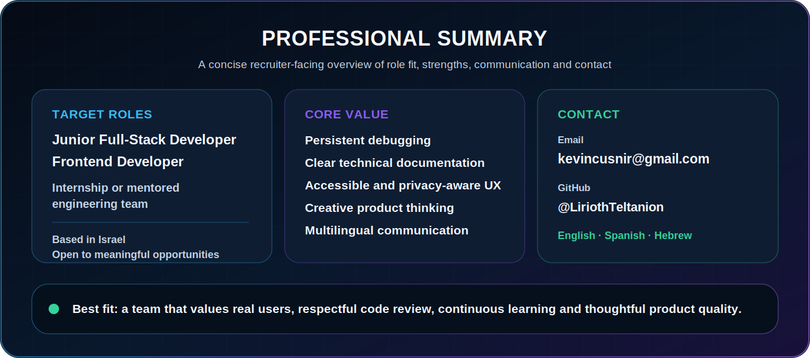

  <a href="mailto:kevincusnir@gmail.com"><strong>✉️ kevincusnir@gmail.com</strong></a>
  &nbsp;·&nbsp;
  <a href="https://www.linkedin.com/in/kevin-cusnir/"><strong>LinkedIn</strong></a>
  &nbsp;·&nbsp;
  <a href="https://github.com/LiriothTeltanion"><strong>GitHub</strong></a>

---

## ✦ Identity map

  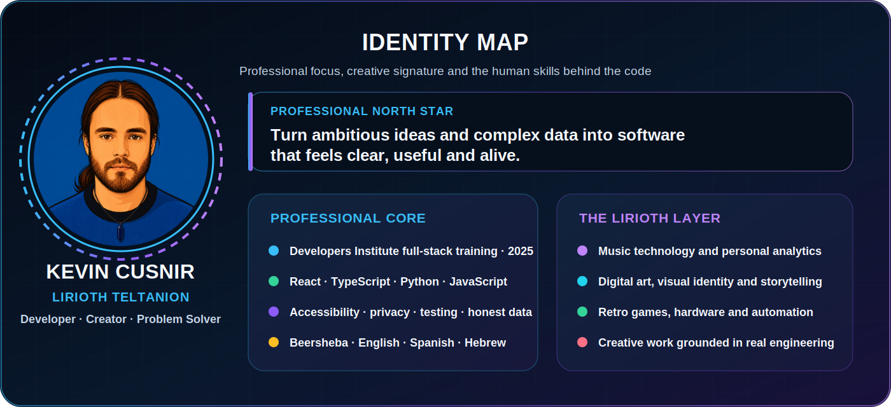

---

## 🌍 Language and communication profile

  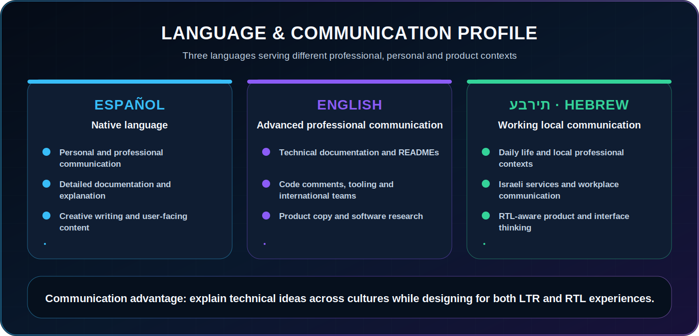

---

## 🌐 Read my complete profile

<strong>🌐 English — open the complete professional profile</strong>

 

## 👋 About me

I am **Kevin Cusnir**, a full-stack developer and creative technologist based in **Beersheba, Israel**. **Lirioth Teltanion** is my creative identity: the name I use for music, gaming, storytelling, experimental technology and projects where engineering benefits from a more distinctive visual and emotional language.

I trained in full-stack development at **Developers Institute in 2025**. My goal is not to collect disconnected exercises or present every experiment as a finished product. I want to build software that feels complete: understandable architecture, thoughtful interfaces, honest limitations, useful documentation and a clear reason to exist.

My background also includes computer repair, system configuration, troubleshooting and customer-facing work. Those experiences taught me something that matters in software development: a technical solution only becomes useful when the person on the other side can understand it, trust it and actually use it.

## 🧭 Professional positioning

I am currently positioning myself for:

- **Junior Full-Stack Developer** roles.
- **Frontend Developer** roles.
- Internships and entry-level engineering opportunities.
- Teams where code review, mentorship and continuous learning are part of the culture.
- Creative-technology projects connecting data, music, interfaces and real user needs.

My public portfolio currently demonstrates strongest evidence in:

- React and TypeScript interfaces.
- Python applications and local tooling.
- Data transformation, validation and visualization.
- Accessibility and multilingual interaction.
- Privacy-first product thinking.
- Automated testing and GitHub Actions.
- Documentation and visual project storytelling.

I am actively strengthening:

- Production backend architecture.
- PostgreSQL and relational modeling.
- Authentication and authorization.
- Docker-based development.
- Integration and end-to-end testing.
- Operational thinking, observability and deployment.

## ✨ What defines my work

- 💻 I build with **React, TypeScript, JavaScript, Python, SQL and Node.js**.
- 🎨 I enjoy combining engineering with visual identity, data storytelling and human-centered UX.
- ♿ I care about keyboard usability, readable contrast, reduced-motion support and clear semantics.
- 🔒 I treat privacy and transparent data handling as product features.
- 🧪 I prefer tests, audits and reproducible builds over vague confidence.
- 🔍 I avoid presenting estimated or invented data as verified fact.
- 📚 I see documentation as part of the product, not an afterthought.
- 🌍 I communicate in **Spanish, English and Hebrew**.
- 🛠️ My technical roots include computer repair, diagnostics, system configuration and troubleshooting.
- 🎧 My creative interests include music production, digital art, retro games, automation, hardware and AI-assisted creation.

> **My direction:** fewer disposable demos, more complete products with a strong idea, clear architecture and memorable presentation. 🚀

## 🧬 Kevin and Lirioth

### 💻 Kevin — the developer

Kevin represents structure, debugging, implementation, documentation and responsibility. This is the side focused on understanding the problem, reducing uncertainty and building a system that another developer can continue.

### 🧙‍♂️ Lirioth — the creative signature

Lirioth represents music, visual language, narrative, worldbuilding and experimentation. This is the side that asks how an application should feel—not only whether it technically works.

### 🤝 The human layer

Technical support and customer-facing work taught me patience, communication and practical empathy. I understand that users may be confused, stressed, unfamiliar with technology or unable to describe the issue precisely. Good software and good support both require listening before solving.

## 🚀 Featured projects

### 🎧 Nova Music Lab

**Nova Music Lab** is a privacy-first musical analytics experience that transforms listening-history exports into statistics, personal records, timelines, emotional maps, cultural insights, achievements and a generative artist identity.

#### Product highlights

- Imports data from **Last.fm, Spotify, Apple Music, ListenBrainz and YouTube**.
- Processes uploaded files locally in the browser.
- Supports **English, Spanish and Hebrew**, including RTL behavior.
- Separates observed facts, inferred information and missing coverage.
- Uses data-quality checks and link validation.
- Includes automated tests and GitHub Actions.
- Uses bundle-size safeguards and lazy-loading architecture.
- Combines analytical depth with a museum-style visual identity.
- Allows visitors to explore a bundled demonstration archive or import their own data.
- Documents optional AI behavior and the privacy implications clearly.

#### Engineering themes

- Data normalization and cross-source deduplication.
- Multilingual application architecture.
- Accessible charts and controls.
- Deep links and shareable sections.
- Local-first processing.
- Deterministic generative visual output.
- Production build validation.
- Honest handling of incomplete metadata.

**Stack:** React · TypeScript · Vite · Tailwind CSS · Vitest · Recharts · Framer Motion

[🌐 Live demo](https://liriothteltanion.github.io/NovaMusicLab/) ·
[💻 Source code](https://github.com/LiriothTeltanion/NovaMusicLab)

---

### 💙 NovaFit

**NovaFit** is an offline health tracker with command-line and desktop interfaces for recording activity, hydration, calories, mood, goals and trends.

#### Product highlights

- Command-line interface and Tkinter desktop GUI.
- SQLite local persistence.
- JSON and CSV import/export.
- Open-Meteo weather integration.
- Demo-data generation with Faker.
- Input validation and clear feedback.
- Local-first data handling.
- Theme-aware desktop presentation.

#### Engineering themes

- Separating application logic from user interfaces.
- Local persistence and schema design.
- Import and export workflows.
- Validation and error handling.
- CLI ergonomics.
- Desktop interface organization.
- API integration with graceful failure behavior.

**Stack:** Python · Tkinter · SQLite · Requests · Faker

[💻 Source code](https://github.com/LiriothTeltanion/NovaFit)

---

### 📚 Fullstack2026

**Fullstack2026** is a structured learning archive containing exercises, challenges and mini-projects across Python, object-oriented programming, JavaScript, DOM manipulation, asynchronous programming and TypeScript.

It preserves the progression that built my technical foundation. It also shows how my documentation, naming, project structure and problem-solving approach evolved over time.

#### What it demonstrates

- Consistent practice.
- Algorithmic foundations.
- Python and object-oriented programming.
- Browser interaction and DOM manipulation.
- Asynchronous JavaScript.
- TypeScript fundamentals.
- Documentation habits.
- Willingness to preserve and improve earlier work instead of hiding the learning process.

[📂 Explore the learning archive](https://github.com/LiriothTeltanion/Fullstack2026)

---

### 👨‍🏫 Christopher Rodríguez — Portfolio and Online CV

This project is a bilingual React and TypeScript portfolio built around a real professional profile.

#### Product highlights

- English and Spanish content architecture.
- Accessible keyboard interactions.
- Theme and accent controls.
- Structured professional data.
- International experience presentation.
- SEO metadata and structured data.
- GitHub Pages deployment.
- Separation between editable content and presentation components.

#### Engineering themes

- Representing another person's professional identity responsibly.
- Maintaining content without editing JSX for every update.
- Accessibility as part of the design system.
- Localization and persistent preferences.
- Deployment workflow and project documentation.

**Stack:** React · TypeScript · Vite · Tailwind CSS · Framer Motion

[💻 Source code](https://github.com/LiriothTeltanion/ChristopherRodriguezCVOnline)

## 🧪 Earlier experiments and learning highlights

- 🏃‍♂️ **Weather-aware tools** — hourly forecasts, local caching, SQLite sessions and workout decisions.
- 🧬 **DNA Evolution OOP Kata** — genes, chromosomes, mutation logic and small simulations.
- 🐉 **Sinaloa Dragon** — a small Phaser side-scroller and retro-game experiment.
- 🔐 **PassKeep** — a private offline password-manager prototype whose threat model and claims require careful security review.
- 🧰 **Computer repair and system work** — hardware diagnostics, Windows configuration, peripheral issues and practical troubleshooting.
- ⚙️ **Automation experiments** — scripts and workflows designed to reduce repetitive tasks.

These are not all flagship projects, but they matter. They show the experiments, failed assumptions, reusable patterns and technical curiosity that shaped the stronger work.

## 🧰 Skills and tools

**Languages:** Python · TypeScript · JavaScript · SQL  
**Frontend:** React · HTML5 · CSS3 · Tailwind CSS · Vite  
**Backend:** Node.js · Express fundamentals · Python application logic · REST APIs  
**Data:** SQLite · JSON · CSV · transformation · normalization · validation  
**Desktop UI:** Tkinter / ttk  
**Testing and quality:** Vitest · unit testing · GitHub Actions · linting · data audits  
**Utilities:** argparse · pathlib · logging · Faker · matplotlib · PowerShell  
**Workflow:** Git · GitHub · Conventional Commits · README-first documentation

## 🛠️ Engineering approach

- Write technical documentation primarily in English.
- Keep naming and structure understandable for another developer.
- Prefer explicit validation and useful error messages.
- Treat accessibility as implementation work, not decorative polish.
- Explain privacy-sensitive network behavior.
- Separate verified facts from inferred or incomplete data.
- Test critical transformations, navigation and production builds.
- Document limitations rather than hiding them.
- Keep security claims proportional to actual review and testing.
- Make visual identity support the product instead of overwhelming it.

## 🌱 Development roadmap

My next major portfolio milestone is a deployed full-stack application that demonstrates:

- A real backend service.
- PostgreSQL.
- Authentication and role-based authorization.
- Secure sessions or token handling.
- REST API design.
- Validation on both client and server.
- Integration tests.
- Docker-based local development.
- CI/CD.
- Logging and operational visibility.
- A realistic demonstration account and documented deployment.

## 🤝 What I can contribute to a team

- Persistent debugging and practical troubleshooting.
- Clear written documentation.
- Multilingual communication.
- Empathy for confused or non-technical users.
- Care around accessibility, privacy and data claims.
- Creative product thinking without losing structure.
- Attention to visual presentation.
- Willingness to receive feedback and revise the implementation.
- A strong interest in understanding why a system works—not only how to make it pass.

## 🎯 Work environment I am looking for

I want to grow inside a team that values:

- Real users and useful outcomes.
- Respectful code review.
- Clear communication.
- Mentorship and accountability.
- Accessibility and product quality.
- Continuous learning.
- Honest engineering trade-offs.
- Room for creativity alongside technical discipline.

## 🤝 Contact

- 💼 [LinkedIn — Kevin Cusnir](https://www.linkedin.com/in/kevin-cusnir/)
- 🐙 [GitHub — LiriothTeltanion](https://github.com/LiriothTeltanion)
- ✉️ [kevincusnir@gmail.com](mailto:kevincusnir@gmail.com)

<a href="#top">⬆️ Back to top</a>

<strong>🌐 Español — abrir el perfil profesional completo</strong>

 

## 👋 Sobre mí

Soy **Kevin Cusnir**, desarrollador full-stack y tecnólogo creativo residente en **Beersheba, Israel**. **Lirioth Teltanion** es mi identidad creativa: el nombre que utilizo para música, videojuegos, storytelling, experimentación tecnológica y proyectos donde la ingeniería se beneficia de un lenguaje visual y emocional más distintivo.

Me formé en desarrollo full-stack en **Developers Institute durante 2025**. Mi meta no es acumular ejercicios desconectados ni presentar cada experimento como un producto terminado. Quiero construir software que se sienta completo: arquitectura comprensible, interfaces pensadas, limitaciones honestas, documentación útil y una razón clara para existir.

Mi experiencia también incluye reparación de computadoras, configuración de sistemas, diagnóstico de fallas y trabajo de atención a personas. Eso me enseñó algo fundamental: una solución técnica solo es útil cuando la persona del otro lado puede comprenderla, confiar en ella y utilizarla.

## 🧭 Posicionamiento profesional

Estoy orientando mi perfil hacia:

- Roles de **Junior Full-Stack Developer**.
- Roles de **Frontend Developer**.
- Internships y oportunidades de entrada al sector.
- Equipos con code review, mentoría y aprendizaje continuo.
- Proyectos de tecnología creativa que conecten datos, música e interfaces.

Mi portafolio demuestra especialmente:

- Interfaces con React y TypeScript.
- Aplicaciones Python y herramientas locales.
- Transformación, validación y visualización de datos.
- Accesibilidad e interacción multilingüe.
- Privacidad y procesamiento local.
- Pruebas automatizadas y GitHub Actions.
- Documentación y presentación visual de proyectos.

Actualmente estoy fortaleciendo:

- Arquitectura backend para producción.
- PostgreSQL y modelado relacional.
- Autenticación y autorización.
- Docker.
- Pruebas de integración y end-to-end.
- Observabilidad, logging y despliegue.

## ✨ Qué define mi trabajo

- 💻 Desarrollo con **React, TypeScript, JavaScript, Python, SQL y Node.js**.
- 🎨 Me gusta unir ingeniería, identidad visual, narrativa de datos y UX centrada en personas.
- ♿ Me importan el uso por teclado, el contraste, el movimiento reducido y la semántica clara.
- 🔒 Considero la privacidad y la transparencia como características del producto.
- 🧪 Prefiero pruebas, auditorías y builds reproducibles.
- 🔍 Evito presentar estimaciones o datos inventados como hechos verificados.
- 📚 La documentación forma parte del producto.
- 🌍 Me comunico en **español, inglés y hebreo**.
- 🛠️ Mis raíces técnicas incluyen reparación, diagnóstico y configuración de sistemas.
- 🎧 Mis intereses incluyen producción musical, arte digital, videojuegos retro, hardware, automatización e IA.

## 🚀 Proyectos destacados

### 🎧 Nova Music Lab

Experiencia de análisis musical centrada en privacidad que transforma historiales de escucha en estadísticas, líneas de tiempo, mapas emocionales, perspectivas culturales, logros e identidad artística generativa.

**Características principales**

- Importación desde Last.fm, Spotify, Apple Music, ListenBrainz y YouTube.
- Procesamiento local en el navegador.
- Inglés, español y hebreo con RTL.
- Auditorías de calidad y validación de enlaces.
- Pruebas automatizadas y GitHub Actions.
- Arquitectura de carga diferida y límites del bundle.
- Visualización de datos y narrativa interactiva.
- Manejo honesto de información incompleta.

**Tecnologías:** React · TypeScript · Vite · Tailwind CSS · Vitest · Recharts · Framer Motion

[🌐 Demo](https://liriothteltanion.github.io/NovaMusicLab/) ·
[💻 Código](https://github.com/LiriothTeltanion/NovaMusicLab)

---

### 💙 NovaFit

Monitor de salud offline con interfaces de consola y escritorio para registrar actividad, hidratación, calorías, estado de ánimo, objetivos y tendencias.

**Características principales**

- CLI y GUI con Tkinter.
- SQLite.
- Importación y exportación JSON y CSV.
- Integración con Open-Meteo.
- Datos de demostración con Faker.
- Validación y mensajes claros.
- Diseño local-first.

**Tecnologías:** Python · Tkinter · SQLite · Requests · Faker

[💻 Código](https://github.com/LiriothTeltanion/NovaFit)

---

### 📚 Fullstack2026

Archivo estructurado de aprendizaje con ejercicios y mini-proyectos de Python, programación orientada a objetos, JavaScript, DOM, asincronía y TypeScript.

Muestra la evolución de mi lógica, documentación, organización y práctica constante.

[📂 Explorar](https://github.com/LiriothTeltanion/Fullstack2026)

---

### 👨‍🏫 Portafolio de Christopher Rodríguez

Portafolio bilingüe en React y TypeScript para un perfil profesional real.

Incluye contenido estructurado, accesibilidad, preferencias persistentes, temas, SEO, experiencia internacional y despliegue mediante GitHub Pages.

[💻 Código](https://github.com/LiriothTeltanion/ChristopherRodriguezCVOnline)

## 🧰 Habilidades y herramientas

**Lenguajes:** Python · TypeScript · JavaScript · SQL  
**Frontend:** React · HTML5 · CSS3 · Tailwind CSS · Vite  
**Backend:** Node.js · fundamentos de Express · lógica Python · APIs REST  
**Datos:** SQLite · JSON · CSV · transformación · normalización · validación  
**GUI:** Tkinter / ttk  
**Pruebas y calidad:** Vitest · pruebas unitarias · GitHub Actions · linting · auditorías  
**Herramientas:** Git · GitHub · PowerShell · pathlib · logging · Faker · matplotlib

## 🛠️ Cómo trabajo

- Documentación técnica principalmente en inglés.
- Estructura y nombres comprensibles.
- Validación explícita y errores útiles.
- Accesibilidad como trabajo de implementación.
- Transparencia sobre comportamiento de red y privacidad.
- Separación entre hechos, inferencias y datos faltantes.
- Pruebas de rutas críticas.
- Limitaciones documentadas.
- Afirmaciones de seguridad proporcionales a la revisión realizada.
- Identidad visual al servicio del producto.

## 🌱 Próximo gran objetivo técnico

Construir y desplegar una aplicación full-stack que demuestre:

- Backend real.
- PostgreSQL.
- Autenticación y roles.
- Validación cliente-servidor.
- Diseño de API.
- Pruebas de integración.
- Docker.
- CI/CD.
- Logging.
- Cuenta de demostración.
- Despliegue documentado.

## 🤝 Lo que aporto

- Persistencia para resolver problemas.
- Documentación clara.
- Comunicación multilingüe.
- Empatía con usuarios no técnicos.
- Atención a privacidad y accesibilidad.
- Pensamiento creativo con estructura.
- Interés por entender el sistema.
- Disposición para recibir feedback y mejorar.

## 🤝 Contacto

- 💼 [LinkedIn — Kevin Cusnir](https://www.linkedin.com/in/kevin-cusnir/)
- 🐙 [GitHub — LiriothTeltanion](https://github.com/LiriothTeltanion)
- ✉️ [kevincusnir@gmail.com](mailto:kevincusnir@gmail.com)

<a href="#top">⬆️ Volver arriba</a>

<strong>🌐 עברית — פתיחת הפרופיל המקצועי המלא</strong>

 

<h2>👋 קצת עליי</h2>

אני <strong>Kevin Cusnir</strong>, מפתח Full-Stack ויוצר טכנולוגי המתגורר ב<strong>באר שבע, ישראל</strong>. <strong>Lirioth Teltanion</strong> היא הזהות היצירתית שלי — השם שבו אני משתמש למוזיקה, גיימינג, סיפורים, ניסויים טכנולוגיים ופרויקטים שבהם ההנדסה מקבלת שפה חזותית ורגשית ייחודית יותר.

עברתי הכשרה בפיתוח Full-Stack ב-<strong>Developers Institute בשנת 2025</strong>. המטרה שלי אינה לצבור תרגילים מנותקים או להציג כל ניסוי כמוצר גמור. אני רוצה לבנות תוכנה שמרגישה שלמה: ארכיטקטורה מובנת, ממשקים מחושבים, מגבלות שמוצגות בכנות, תיעוד שימושי וסיבה ברורה לקיומו של המוצר.

הרקע שלי כולל גם תיקון מחשבים, הגדרת מערכות, אבחון תקלות ועבודה מול אנשים. הניסיון הזה לימד אותי שפתרון טכני הופך לשימושי רק כאשר האדם בצד השני יכול להבין אותו, לסמוך עליו ולהשתמש בו.

<h2>🧭 כיוון מקצועי</h2>

אני מכוון לתפקידים כגון:

<ul>
  <li><strong>Junior Full-Stack Developer</strong>.</li>
  <li><strong>Frontend Developer</strong>.</li>
  <li>Internship או תפקיד כניסה לצוות הנדסי.</li>
  <li>סביבה עם code review, ליווי ולמידה מתמשכת.</li>
  <li>פרויקטים המחברים נתונים, מוזיקה, ממשקים וצרכים אמיתיים.</li>
</ul>

הפורטפוליו שלי מציג במיוחד:

<ul>
  <li>React ו-TypeScript.</li>
  <li>יישומי Python וכלים מקומיים.</li>
  <li>טרנספורמציה, אימות וויזואליזציה של נתונים.</li>
  <li>נגישות וממשקים רב-לשוניים.</li>
  <li>חשיבה על פרטיות ועיבוד מקומי.</li>
  <li>בדיקות אוטומטיות ו-GitHub Actions.</li>
  <li>תיעוד והצגה חזותית של פרויקטים.</li>
</ul>

<h2>✨ מה מגדיר את העבודה שלי</h2>

<ul>
  <li>💻 React, TypeScript, JavaScript, Python, SQL ו-Node.js.</li>
  <li>🎨 שילוב בין הנדסה, זהות חזותית וסיפור באמצעות נתונים.</li>
  <li>♿ שימוש במקלדת, ניגודיות, הפחתת תנועה וסמנטיקה ברורה.</li>
  <li>🔒 פרטיות ושקיפות כחלק מהמוצר.</li>
  <li>🧪 בדיקות, audits ו-builds שניתנים לשחזור.</li>
  <li>🔍 הפרדה בין עובדות, inference ומידע חסר.</li>
  <li>📚 תיעוד כחלק מהמוצר.</li>
  <li>🌍 ספרדית, אנגלית ועברית.</li>
  <li>🛠️ תיקון מחשבים, אבחון והגדרת מערכות.</li>
  <li>🎧 מוזיקה, אמנות, משחקי רטרו, חומרה, אוטומציה ו-AI.</li>
</ul>

<h2>🚀 פרויקטים נבחרים</h2>

<h3>🎧 Nova Music Lab</h3>

חוויית ניתוח מוזיקלי ממוקדת פרטיות שהופכת היסטוריית האזנה לסטטיסטיקות, צירי זמן, מפות רגשיות, תובנות תרבותיות, הישגים וזהות אמן גנרטיבית.

<ul>
  <li>ייבוא מ-Last.fm, Spotify, Apple Music, ListenBrainz ו-YouTube.</li>
  <li>עיבוד מקומי בדפדפן.</li>
  <li>אנגלית, ספרדית ועברית עם RTL.</li>
  <li>בדיקות איכות ואימות קישורים.</li>
  <li>בדיקות אוטומטיות ו-GitHub Actions.</li>
  <li>ויזואליזציה של נתונים וסיפור אינטראקטיבי.</li>
  <li>טיפול כנה במידע חסר.</li>
</ul>

<strong>טכנולוגיות:</strong> React · TypeScript · Vite · Tailwind CSS · Vitest · Recharts · Framer Motion

  <a href="https://liriothteltanion.github.io/NovaMusicLab/">🌐 דמו</a> ·
  <a href="https://github.com/LiriothTeltanion/NovaMusicLab">💻 קוד</a>

<h3>💙 NovaFit</h3>

מערכת מעקב בריאות לא מקוונת עם CLI וממשק שולחני.

<ul>
  <li>Tkinter.</li>
  <li>SQLite.</li>
  <li>ייבוא וייצוא JSON ו-CSV.</li>
  <li>Open-Meteo.</li>
  <li>Faker לנתוני הדגמה.</li>
  <li>אימות קלט ומשוב ברור.</li>
</ul>

<strong>טכנולוגיות:</strong> Python · Tkinter · SQLite · Requests · Faker

<a href="https://github.com/LiriothTeltanion/NovaFit">💻 קוד</a>

<h3>📚 Fullstack2026</h3>

ארכיון למידה מסודר הכולל Python, OOP, JavaScript, DOM, async ו-TypeScript.

<a href="https://github.com/LiriothTeltanion/Fullstack2026">📂 פתיחת הארכיון</a>

<h3>👨‍🏫 הפורטפוליו של Christopher Rodríguez</h3>

פורטפוליו דו-לשוני ב-React וב-TypeScript עם תוכן מובנה, נגישות, ערכות נושא, SEO ו-GitHub Pages.

<a href="https://github.com/LiriothTeltanion/ChristopherRodriguezCVOnline">💻 קוד</a>

<h2>🧰 מיומנויות וכלים</h2>

<strong>שפות תכנות:</strong> Python · TypeScript · JavaScript · SQL

<strong>Frontend:</strong> React · HTML5 · CSS3 · Tailwind CSS · Vite

<strong>Backend:</strong> Node.js · יסודות Express · Python · REST APIs

<strong>נתונים:</strong> SQLite · JSON · CSV · נרמול · אימות

<strong>איכות:</strong> Vitest · בדיקות יחידה · GitHub Actions · linting · audits

<h2>🌱 היעד הטכני הבא</h2>

לבנות ולהעלות אפליקציית Full-Stack הכוללת backend אמיתי, PostgreSQL, authentication, roles, validation, integration tests, Docker, CI/CD, logging וחשבון demo.

<h2>🤝 מה אני מביא לצוות</h2>

<ul>
  <li>התמדה ב-debugging.</li>
  <li>תיעוד ברור.</li>
  <li>תקשורת רב-לשונית.</li>
  <li>אמפתיה למשתמשים לא טכניים.</li>
  <li>אחריות בנושאי פרטיות ונגישות.</li>
  <li>חשיבה יצירתית עם מבנה.</li>
  <li>נכונות לקבל feedback ולהשתפר.</li>
</ul>

<h2>🤝 יצירת קשר</h2>

<ul>
  <li>💼 <a href="https://www.linkedin.com/in/kevin-cusnir/">LinkedIn — Kevin Cusnir</a></li>
  <li>🐙 <a href="https://github.com/LiriothTeltanion">GitHub — LiriothTeltanion</a></li>
  <li>✉️ <a href="mailto:kevincusnir@gmail.com">kevincusnir@gmail.com</a></li>
</ul>

<a href="#top">⬆️ חזרה למעלה</a>

---

## 🌉 Transferable experience bridge

  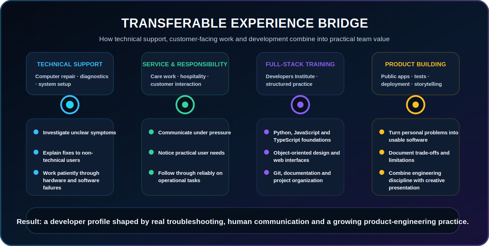

---

## 🧭 Developer journey

  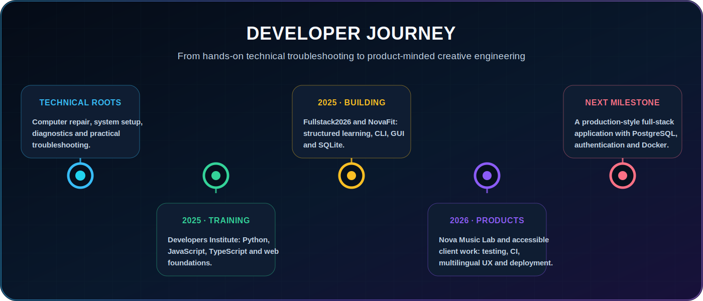

---

## 🧰 Technology constellation

  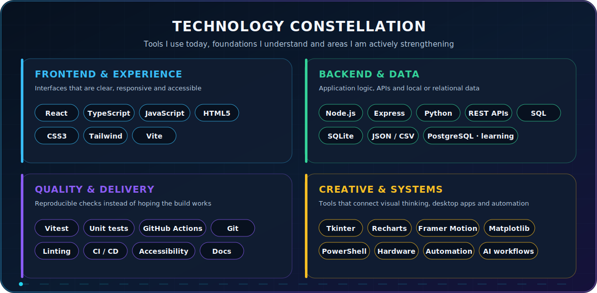

---

## 🧩 Project capability matrix

  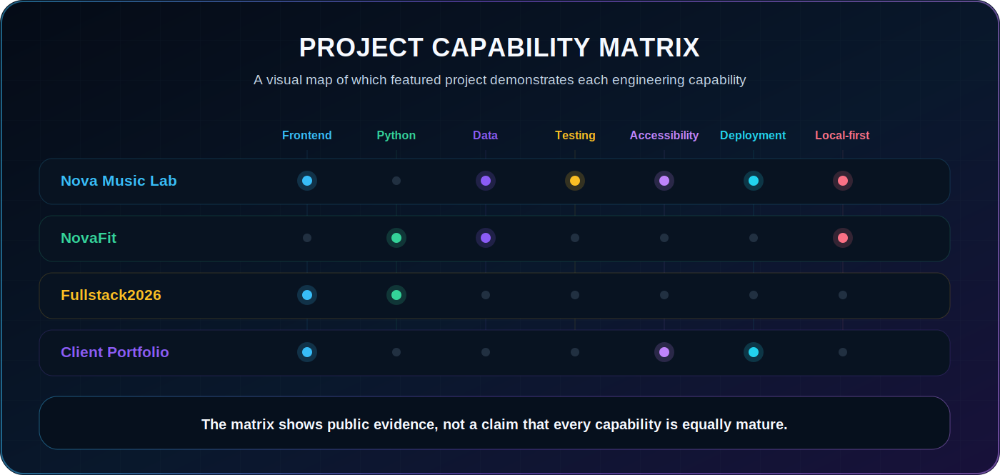

---

## 🌟 Project ecosystem

  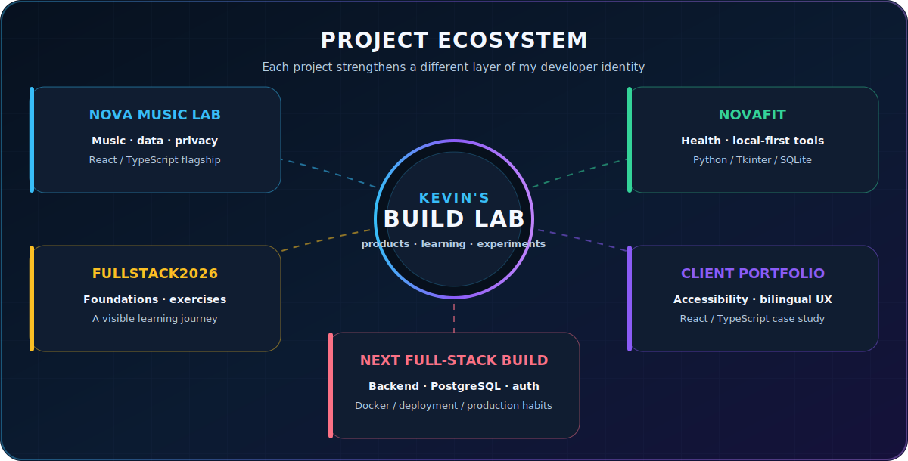

 

<table>
<tr>
<td width="50%" valign="top">

<a href="https://github.com/LiriothTeltanion/NovaMusicLab">
  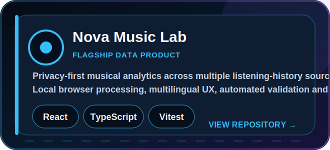
</a>

</td>
<td width="50%" valign="top">

<a href="https://github.com/LiriothTeltanion/NovaFit">
  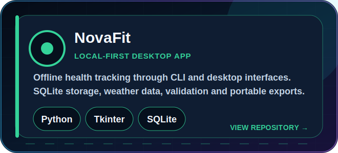
</a>

</td>
</tr>
<tr>
<td width="50%" valign="top">

<a href="https://github.com/LiriothTeltanion/Fullstack2026">
  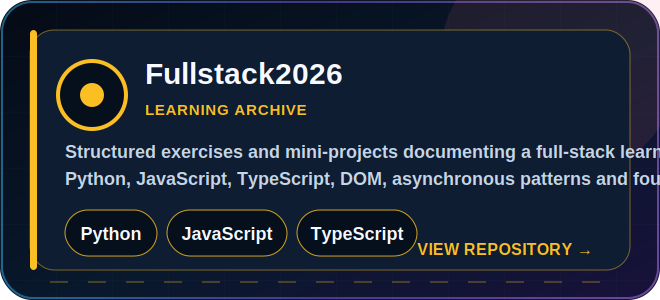
</a>

</td>
<td width="50%" valign="top">

<a href="https://github.com/LiriothTeltanion/ChristopherRodriguezCVOnline">
  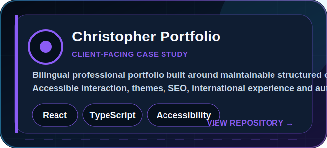
</a>

</td>
</tr>
</table>

---

## 🧠 Engineering principles

  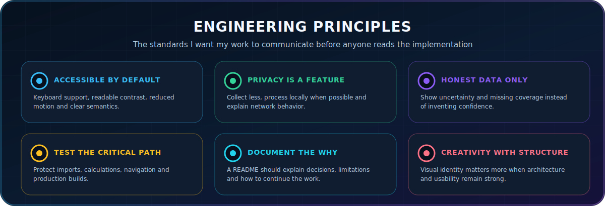

---

## 🎧 Creative universe

  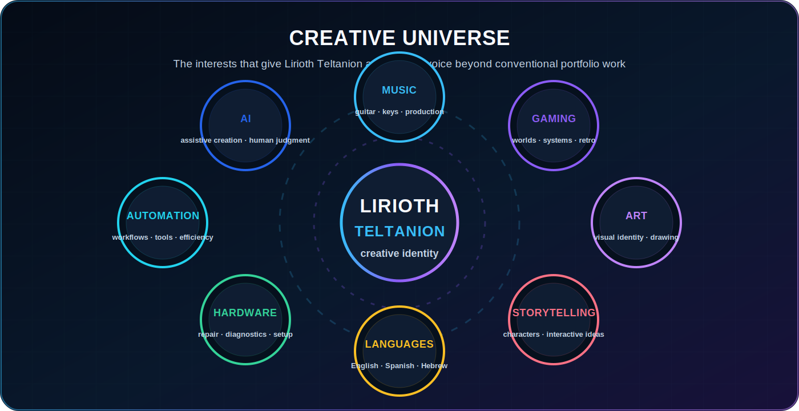

---

## 🔭 Current focus

  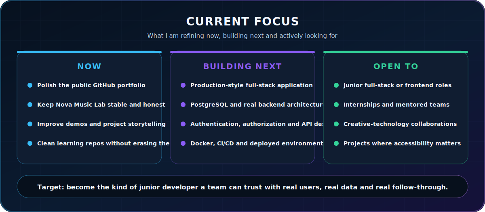

---

## 🧪 Lab notes

<table>
<tr>
<td width="50%" valign="top">

### 🏃‍♂️ Weather-aware tools

Explorations combining hourly forecasts, local caching, SQLite sessions and health or workout decisions.

</td>
<td width="50%" valign="top">

### 🧬 Object-oriented simulations

Exercises using genes, chromosomes, mutations and small simulations to strengthen domain modeling.

</td>
</tr>
<tr>
<td width="50%" valign="top">

### 🐉 Retro game experiments

Small Phaser prototypes focused on input loops, movement, visual style and the joy of building playable systems.

</td>
<td width="50%" valign="top">

### 🔐 Security learning lab

PassKeep remains private while its threat model, secret handling, test strategy and user-facing claims are reviewed carefully.

</td>
</tr>
<tr>
<td width="50%" valign="top">

### ⚙️ Automation and agent workflows

Experiments using AI-assisted coding, structured prompts and repeatable development workflows—always with human review and final responsibility.

</td>
<td width="50%" valign="top">

### 🎹 Music and creative technology

Ideas connecting musical identity, personal analytics, generative visuals, digital production and interactive storytelling.

</td>
</tr>
</table>

---

## 📈 GitHub pulse

  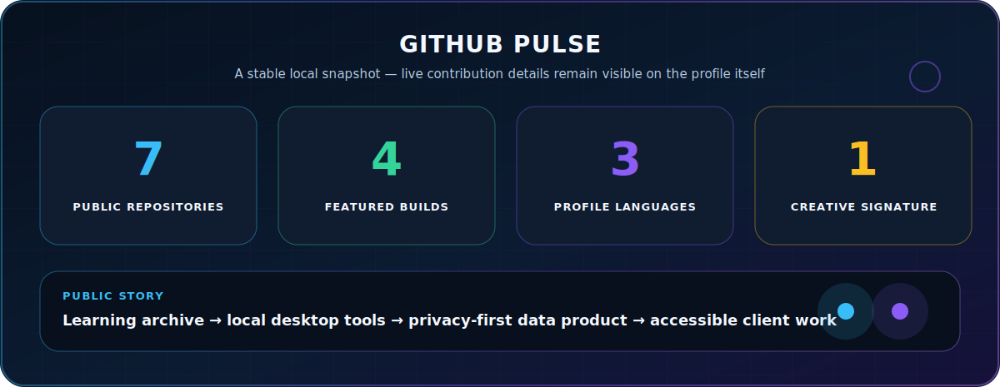

> This image is a curated snapshot, not a live score. Current contribution activity remains visible directly on the GitHub profile.

---

## 📬 Let’s connect

  

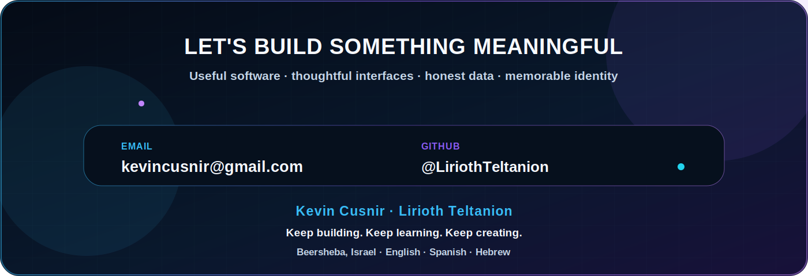

Profile content © Kevin Cusnir. Individual repositories define their own licenses.

