<picture>
  <source media="(max-width: 640px) and (prefers-reduced-motion: reduce)" srcset="./assets/profile-banner-mobile-static.svg" />
  <source media="(max-width: 640px)" srcset="./assets/profile-banner-mobile-animated.svg" />
  <source media="(prefers-reduced-motion: reduce)" srcset="./assets/profile-banner-static.svg" />
  
</picture>

# Kevin Cusnir · Lirioth Teltanion ✨

<strong>Junior Frontend & Full-Stack Developer · Creative Technologist</strong>

**I build React, TypeScript, Python and SQL products with accessible multilingual UX, data honesty and practical automation.**

[💼 LinkedIn](https://www.linkedin.com/in/kevin-cusnir-883173b4/) · [📄 CV EN](https://github.com/LiriothTeltanion/CV/blob/main/CV_EN.md) · [CV ES](https://github.com/LiriothTeltanion/CV/blob/main/CV_ES.md) · [CV HE](https://github.com/LiriothTeltanion/CV/blob/main/CV_HE.md) · [✉️ Email](mailto:kevincusnir@gmail.com) · [🎧 Nova Music Lab live](https://liriothteltanion.github.io/NovaMusicLab/)

**Open to:** Junior Frontend & Full-Stack roles · **Born in:** San Cristóbal, Venezuela · **Based in:** Beersheba, Israel · **Languages:** ES · EN · HE

[Read in English](./README.md) · [Leer en español](./PROFILE_ES.md) · [עברית](./PROFILE_HE.md)

[Snapshot](#-recruiter-snapshot) · [Projects](#-featured-projects) · [Evidence](#-engineering-evidence) · [Global](#-global-communication) · [Contact](#-contact)

---

## ⚡ Recruiter snapshot

I’m **Kevin Cusnir**, born in **San Cristóbal, Venezuela** and now based in **Beersheba, Israel**. I build React, TypeScript, Python and SQL products with accessible multilingual UX, data honesty and practical automation.

> **Open to junior frontend, full-stack and creative-technology opportunities.** Best fit: a junior team with mentorship, real users, thoughtful review and room for structured creativity.

| What I can prove publicly | Strongest evidence |
|---|---|
| React and TypeScript product work | Nova Music Lab and Christopher Rodríguez Portfolio |
| Python, SQLite and desktop workflows | NovaFit Ultimate 4.0; Fullstack2026 shows the learning path |
| Data, accessibility and multilingual UX | Honest source-aware analytics; EN/ES/HE, RTL, keyboard and reduced-motion work |
| Delivery discipline | Automated tests, CI, live Pages builds, bundle budgets and release checks |

**Review path:** **30 seconds**: Read the snapshot and role positioning · **2 minutes**: Open Nova Music Lab and NovaFit · **5 minutes**: Inspect tests, CI, README architecture and recent commits · **15 minutes**: Run NovaFit or explore the live music museum.

---

## 🚀 Featured projects

### 🎧 Nova Music Lab

**Status:** Live local-first flagship 
**Problem:** Listening exports are fragmented, hard to compare and easy to misrepresent. 
**Solution:** A local-first music museum that turns exports from five listening ecosystems into source-aware analytics, visual stories and a portable personal archive. 
**Stack:** React · TypeScript · Vite · Vitest · Recharts · GitHub Actions 
**Evidence:** Five import families, source normalization, deduplication, automated tests, bundle budgets, CI and a live GitHub Pages build 
**Role signal:** Frontend engineering · data visualization · privacy-aware product thinking 
**Highlights:** Five import families normalized into one model · Lazy-loaded museum rooms and bundle budgets · Fourteen themes, EN/ES UX, reduced-motion support and Hebrew resource tooling 
[Open Nova Music Lab live demo](https://liriothteltanion.github.io/NovaMusicLab/) · [Nova Music Lab source](https://github.com/LiriothTeltanion/NovaMusicLab)

<a href="https://liriothteltanion.github.io/NovaMusicLab/">
<picture>
  <source media="(max-width: 640px)" srcset="./assets/nova-music-live-preview-mobile.jpg" />
  
</picture>
</a>

**Live product preview:** responsive React interface, bundled demonstration museum and a direct path to the working deployment.

<strong>🎧 Open the Nova Music Lab data journey</strong>

<picture>
  <source media="(max-width: 640px) and (prefers-reduced-motion: reduce)" srcset="./assets/nova-music-journey-mobile-static.svg" />
  <source media="(max-width: 640px)" srcset="./assets/nova-music-journey-mobile.svg" />
  <source media="(prefers-reduced-motion: reduce)" srcset="./assets/nova-music-journey-static.svg" />
  
</picture>

Five import families become one deduplicated, source-aware listening history. Missing fields remain visible as gaps, and raw exports stay in the browser.

[Explore the live music museum](https://liriothteltanion.github.io/NovaMusicLab/) · [Inspect the Nova Music Lab source](https://github.com/LiriothTeltanion/NovaMusicLab)

### 💙 NovaFit

**Status:** Ultimate 4.0 local-first desktop product 
**Problem:** Daily wellness data should remain portable, understandable and private. 
**Solution:** A multi-user Python CLI and Tkinter wellness intelligence studio with profile-isolated SQLite, EN/ES/HE, Hebrew RTL, twelve themes, four analytics workspaces, explainable Sport & Data recommendations, motivation, portable reports and self-healing Windows delivery. 
**Stack:** Python · Tkinter · SQLite · Requests · Faker · Matplotlib 
**Evidence:** 74 automated tests, twelve-theme gallery, trilingual UI with Hebrew RTL validation, profile-isolated schema v4, Training Atlas, workspace-safe audit and strict clean release staging 
**Role signal:** Python application architecture · desktop UX · SQLite migrations · i18n/RTL · analytics · release engineering 
**Highlights:** Multi-user profiles with isolated records, goals, language and theme · EN/ES/HE interface with true Hebrew RTL shell behavior · Command Center, Trend Lab, Consistency Map, Training Atlas and Sport & Data Coach · Workspace-safe checker preserves user DB; release staging excludes private runtime files 
[NovaFit source](https://github.com/LiriothTeltanion/NovaFit)

<strong>💙 Open the NovaFit product, analytics and visual system</strong>

> **Public-data boundary:** the visuals below use profile-independent or seeded demonstration data; no personal wellness history is displayed.

<picture>
  <source media="(max-width: 640px)" srcset="./assets/motivation-center-mobile.svg" />
  
</picture>

**Why this project matters:** NovaFit brings multi-user data isolation, a complete Tkinter interface, trilingual UX, automation-friendly CLI workflows, safe migrations, explainable suggestions, analytics, portable reports and Windows delivery into one local-first product.

The Training Atlas is profile-independent; the theme contact sheet uses seeded demonstration records without publishing a profile name.

**Twelve themes:** Midnight Neon · Aurora Borealis · Negev Sunrise · Ocean Depth · Forest Focus · Rose Quartz · Cloud Day · Solar Paper · High Contrast · Royal Sapphire · Cyber Lime · Sunset Arcade.

[Inspect the NovaFit source](https://github.com/LiriothTeltanion/NovaFit)

<strong>🌍 Open NovaFit profiles, EN/ES/HE, coach and safe delivery</strong>

> **Public-data boundary:** this system map contains no profile names, dates or wellness metrics.

<picture>
  <source media="(max-width: 640px)" srcset="./assets/novafit-trust-system-mobile.svg" />
  
</picture>

Each profile owns isolated records, goals, language, theme and activity preferences. English and Spanish use LTR; Hebrew moves the shell to RTL. Suggestions expose data confidence and reasons while avoiding medical claims.

The checker repairs a local `.venv`, validates Matplotlib and `Asia/Jerusalem`, runs 74 tests, preserves an existing user database in workspace mode, and uses strict clean staging for downloadable releases.

### 👨‍🏫 Christopher Rodríguez Portfolio

**Status:** Client/collaboration case study 
**Problem:** A real educator needed a maintainable bilingual professional presence. 
**Solution:** An accessible React and TypeScript portfolio with structured content, verification states, persistent themes and GitHub Pages delivery. 
**Stack:** React · TypeScript · Vite · Tailwind CSS · Framer Motion 
**Evidence:** EN/ES content architecture, keyboard UX, reduced motion, SEO and automated deployment 
**Role signal:** Client communication · accessible frontend · maintainable content architecture 
**Highlights:** Content separated from presentation · Bilingual EN/ES experience and persistent preferences · Verification states for professional claims 
[Open Christopher Rodríguez Portfolio live demo](https://liriothteltanion.github.io/ChristopherRodriguezCVOnline/) · [Christopher Rodríguez Portfolio source](https://github.com/LiriothTeltanion/ChristopherRodriguezCVOnline)

### 📚 Fullstack2026

**Status:** Audited six-week learning archive 
**Problem:** Course exercises need context, progression and reproducible quality checks. 
**Solution:** A structured archive from Python and OOP through JavaScript, DOM, async workflows, TypeScript, Node and databases. 
**Stack:** Python · JavaScript · TypeScript · Node.js · SQL 
**Evidence:** Six curriculum weeks, 14 discoverable test files, CI, generated audits and transparently documented remaining quality gates 
**Role signal:** Learning progression · problem solving · Git/PR discipline 
**Highlights:** Python and OOP foundations · DOM, asynchronous JavaScript, TypeScript, Node and SQL · Repository-wide documentation, audit reports and visible unresolved gates 
[Fullstack2026 source](https://github.com/LiriothTeltanion/Fullstack2026)

---

## 🧪 Engineering evidence

<picture>
  <source media="(max-width: 640px) and (prefers-reduced-motion: reduce)" srcset="./assets/engineering-orbit-mobile-static.svg" />
  <source media="(max-width: 640px)" srcset="./assets/engineering-orbit-mobile.svg" />
  
</picture>

> Evidence counts come from the featured public projects and their documented quality pipelines.

| Evidence across featured work | Count |
|---|---:|
| Featured products/case studies | **4** |
| React or TypeScript projects | **3** |
| Python evidence areas | **2** |
| Multilingual/accessibility projects (including RTL) | **3** |
| Automated quality pipelines | **3** |

### Core stack

**Languages:** TypeScript · JavaScript · Python · SQL  
**Frontend:** React · HTML5 · CSS3 · Tailwind CSS · Vite · Accessibility · i18n / RTL  
**Backend & data:** Node.js · Express fundamentals · REST APIs · SQLite · PostgreSQL learning · JSON / CSV  
**Testing & quality:** Vitest · Testing Library · unittest · GitHub Actions · linting · data audits · bundle budgets  
**Workflow:** Git · GitHub · Conventional Commits · README-first documentation · AI-assisted review with explicit verification

---

## 🌍 Global communication

**Life route:** San Cristóbal, Venezuela → Beersheba, Israel

Country boundaries and deterministic tiny-state markers represent 195 sovereign states while framing a personal journey from Venezuelan roots to an Israeli home, supported by Spanish, English and Hebrew communication.

<picture>
  <source media="(max-width: 640px) and (prefers-reduced-motion: reduce)" srcset="./assets/world-globe-mobile-static.svg" />
  <source media="(max-width: 640px)" srcset="./assets/world-globe-mobile.svg" />
  <source media="(prefers-reduced-motion: reduce)" srcset="./assets/world-globe-static.svg" />
  
</picture>

| Language | Level | Product value |
|---|---|---|
| **Spanish** | Native | Clear communication and Spanish localization |
| **English** | Advanced professional | Technical documentation and international collaboration |
| **Hebrew** | Working local proficiency | Israeli workplace communication and RTL product testing |

---

## 🌱 Current growth focus

<picture>
  <source media="(max-width: 640px)" srcset="./assets/learning-roadmap-mobile.svg" />
  
</picture>

- Production backend architecture
- PostgreSQL relational modeling and migrations
- Authentication and role-based authorization
- Docker-based development and deployment operations
- Integration and end-to-end testing
- Structured logging, monitoring and incident-ready thinking

The next portfolio milestone is a deployed full-stack product with PostgreSQL, authentication, Docker, integration tests, structured logging and a documented demo account.

---

<strong>🧠 Engineering approach and transferable strengths</strong>

### What I bring to a team

- Persistent debugging and practical troubleshooting
- Accessible multilingual product design, including RTL behavior
- Data transformation, validation and honest handling of uncertainty
- Clear technical documentation and visual product storytelling
- Local-first privacy decisions and proportional security claims

### Working principles

- Make the user-facing claim proportional to the evidence.
- Keep inputs validated and failure states actionable.
- Treat accessibility, privacy and documentation as implementation work.
- Prefer small reversible changes, focused commits and reproducible checks.
- Use AI to accelerate review and exploration without outsourcing understanding.

<strong>🎓 Education and structured learning</strong>

**Full-Stack Development — Developers Institute, Israel**  
2025–2026  
**Coverage:** Python, OOP, SQL, JavaScript, React, Redux, Node.js, Express, JWT, TypeScript, Git/GitHub and deployment.  
**Current status:** Completing and converting remaining coursework into tested, deployable portfolio evidence.

The public learning archive remains separate from production-ready projects so recruiters can distinguish progression from finished product evidence.

<strong>🧙‍♂️ Kevin and Lirioth — professional structure and creative signature</strong>

**Kevin** is the professional engineering identity: implementation, debugging, documentation, responsibility and collaboration.

**Lirioth Teltanion** is the creative signature: music technology, visual language, narrative systems, experimental interfaces and generative art.

Together, these identities make technically sound products easier to understand, remember and enjoy.

---

## 🤝 Contact

- 💼 [LinkedIn — Kevin Cusnir](https://www.linkedin.com/in/kevin-cusnir-883173b4/)
- 📄 [English CV](https://github.com/LiriothTeltanion/CV/blob/main/CV_EN.md) · [Currículum en español](https://github.com/LiriothTeltanion/CV/blob/main/CV_ES.md) · [קורות חיים בעברית](https://github.com/LiriothTeltanion/CV/blob/main/CV_HE.md)
- 🐙 [GitHub — Lirioth Teltanion](https://github.com/LiriothTeltanion)
- ✉️ [Email Kevin](mailto:kevincusnir@gmail.com)

<a href="#top">⬆️ Back to top</a>

<picture>
  <source media="(prefers-reduced-motion: reduce)" srcset="./assets/brand/kc-lt-signature.svg" />
  
</picture>

**Code with purpose. Design with personality. Data with honesty.** 💙

