<!-- profile-version: 2.3.0; release-tag: v2.3.0; release-title: Profile 2.3 — Verified Ivrit Synchronization Edition -->

<picture>
  <source media="(max-width: 640px) and (prefers-reduced-motion: reduce)" srcset="./assets/profile-banner-mobile-static.svg" />
  <source media="(max-width: 640px)" srcset="./assets/profile-banner-mobile-animated.svg" />
  <source media="(prefers-reduced-motion: reduce)" srcset="./assets/profile-banner-static.svg" />
  
</picture>

# Kevin Cusnir · Lirioth Teltanion ✨

<strong>Junior Frontend & Full-Stack Developer · Creative Technologist</strong>

**I build React, TypeScript, Python and SQL products with accessible multilingual UX, data honesty and practical automation.**

[💼 LinkedIn](https://www.linkedin.com/in/kevin-cusnir-883173b4/) · [📄 CV EN](https://github.com/LiriothTeltanion/CV/blob/main/CV_EN.md) · [CV ES](https://github.com/LiriothTeltanion/CV/blob/main/CV_ES.md) · [CV HE](https://github.com/LiriothTeltanion/CV/blob/main/CV_HE.md) · [✉️ Email](mailto:kevincusnir@gmail.com) · [🎧 Nova Music Lab live](https://liriothteltanion.github.io/NovaMusicLab/) · [א Ivrit Sheli live](https://ivritsheli-production.up.railway.app)

**Open to:** Junior Frontend & Full-Stack roles · **Born in:** San Cristóbal, Venezuela · **Based in:** Beersheba, Israel · **Languages:** ES · EN · HE

[Read in English](./README.md) · [Leer en español](./PROFILE_ES.md) · [עברית](./PROFILE_HE.md)

[Snapshot](#-recruiter-snapshot) · [Projects](#-featured-projects) · [Evidence](#-engineering-evidence) · [Global](#-global-communication) · [Contact](#-contact)

---

## ⚡ Recruiter snapshot

I’m **Kevin Cusnir**, born in **San Cristóbal, Venezuela** and now based in **Beersheba, Israel**. I build React, TypeScript, Python and SQL products with accessible multilingual UX, data honesty and practical automation.

> **Open to junior frontend, full-stack and creative-technology opportunities.** Best fit: a junior team with mentorship, real users, thoughtful review and room for structured creativity.

| What I can prove publicly | Strongest evidence |
|---|---|
| React and TypeScript product work | Nova Music Lab, Ivrit Sheli and Christopher Rodríguez Portfolio |
| Full-stack, Python and data persistence | Ivrit Sheli v2.2.0 with FastAPI/PostgreSQL; NovaFit v4.2.0 with Python/SQLite |
| Data, accessibility and multilingual UX | Honest source-aware analytics; EN/ES/HE, RTL, keyboard and reduced-motion work |
| Delivery discipline | 187-test full-stack proof, Docker, CI, live deployments, bundle budgets and release checks |

**Review path:** **30 seconds**: Read the snapshot and role positioning · **2 minutes**: Open Nova Music Lab and Ivrit Sheli · **5 minutes**: Inspect tests, CI, security architecture and recent releases · **15 minutes**: Run Ivrit Sheli or NovaFit, or explore the live music museum.

---

## 🚀 Featured projects

### 🎧 Nova Music Lab

**Status:** Live local-first flagship · **Stack:** React · TypeScript · Vite · Vitest · Recharts · GitHub Actions 
**Problem → solution:** Listening exports are fragmented, hard to compare and easy to misrepresent. A local-first music museum that turns exports from five listening ecosystems into source-aware analytics, visual stories and a portable personal archive. 
**Evidence:** Five import families, source normalization, deduplication, automated tests, bundle budgets, CI and a live GitHub Pages build · **Role signal:** Frontend engineering · data visualization · privacy-aware product thinking 
[Open Nova Music Lab live demo](https://liriothteltanion.github.io/NovaMusicLab/) · [Nova Music Lab source](https://github.com/LiriothTeltanion/NovaMusicLab)

<a href="https://liriothteltanion.github.io/NovaMusicLab/">
<picture>
  <source media="(max-width: 640px)" srcset="./assets/nova-music-live-preview-mobile.jpg" />
  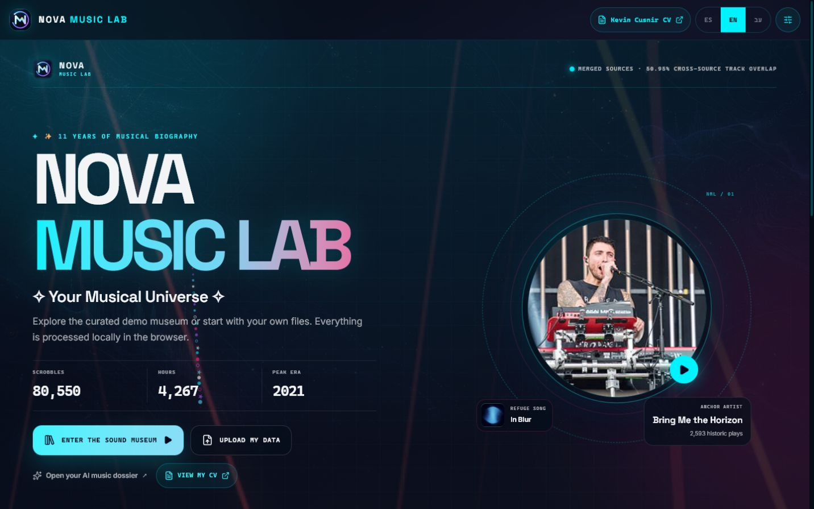
</picture>
</a>

**Live product preview:** responsive React interface, bundled demonstration museum and a direct path to the working deployment.

<strong>🎧 Open the Nova Music Lab data journey</strong>

<picture>
  <source media="(max-width: 640px) and (prefers-reduced-motion: reduce)" srcset="./assets/nova-music-journey-mobile-static.svg" />
  <source media="(max-width: 640px)" srcset="./assets/nova-music-journey-mobile.svg" />
  <source media="(prefers-reduced-motion: reduce)" srcset="./assets/nova-music-journey-static.svg" />
  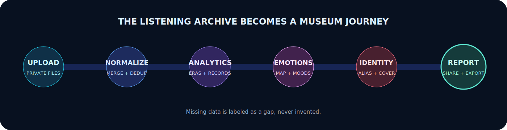
</picture>

Five import families become one deduplicated, source-aware listening history. Missing fields remain visible as gaps, and raw exports stay in the browser.

[Explore the live music museum](https://liriothteltanion.github.io/NovaMusicLab/) · [Inspect the Nova Music Lab source](https://github.com/LiriothTeltanion/NovaMusicLab)

### א Ivrit Sheli

**Status:** Live v2.2.0 dual-mode full-stack product · **Stack:** React 19 · TypeScript · FastAPI · Python · PostgreSQL 17 · SQLite · Alembic · Docker · Railway 
**Problem → solution:** Hebrew learners need focused practice, progress and multilingual guidance without surrendering private study data or depending on a fragile cloud service. A private-first trilingual Hebrew-learning product with local SQLite, authenticated PostgreSQL, native RTL, accessible motion and a synthetic read-only public demo. 
**Evidence:** Verified Railway production and PostgreSQL readiness at commit c8c928661bdc, with 139 backend + 48 frontend = 187 passing tests; GitHub OAuth consent handoff and cancellation are verified, while final live code exchange, session refresh and logout remain unverified end to end · **Role signal:** Full-stack architecture · backend security · PostgreSQL ownership · integration testing · multilingual RTL UX 
[Open Ivrit Sheli live demo](https://ivritsheli-production.up.railway.app) · [Ivrit Sheli source](https://github.com/LiriothTeltanion/IvritSheli)

<strong>א Open the archived Ivrit Sheli 2.1.x product tour and verified 2.2.0 full-stack proof</strong>

<strong>Public-data boundary:</strong> Every frame uses the repository's synthetic read-only demo learner; it contains no private study history, credential, token, provider result or production database record.

<strong>Visual evidence boundary:</strong> these 2.1.x screens are interaction history, not visual proof of the live 2.2.0 interface.

<picture>
  <source media="(max-width: 640px) and (prefers-reduced-motion: reduce)" srcset="./assets/ivrit-sheli-2-mobile.png" />
  <source media="(max-width: 640px)" srcset="./assets/ivrit-sheli-2-mobile.png" />
  <source media="(prefers-reduced-motion: reduce)" srcset="./assets/ivrit-sheli-2-dashboard.png" />
  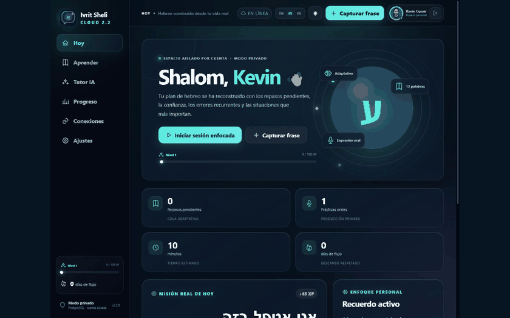
</picture>

<strong>Archived Ivrit Sheli 2.1.x interface:</strong> These pre-2.2 frames document the earlier desktop, mobile and Hebrew RTL interface. They remain useful interaction history but do not claim visual proof of the verified live 2.2.0 deployment.

<strong>Verified v2.2.0 evidence:</strong> 139 backend + 48 frontend = 187 passing tests · Railway production · PostgreSQL 17 ready · live/ready health checks true · production commit <code>c8c928661bdc</code> · tenant RLS · Alembic · non-root Docker · redacted structured JSON logs.

<strong>OAuth boundary:</strong> Consent handoff and cancellation are verified; the final live authorization-code exchange, authenticated refresh persistence and logout are not verified end to end.

<strong>Publication boundary:</strong> the verified deployment, Git tag and GitHub Release now agree on v2.2.0.

<a href="https://github.com/LiriothTeltanion/IvritSheli">Inspect the Ivrit Sheli source</a> · <a href="https://github.com/LiriothTeltanion/IvritSheli/blob/main/TEST_REPORT.md">Review the test contract</a> · <a href="./data/project-snapshots/ivrit-sheli.json">Inspect the reviewed project snapshot</a> · <a href="./assets/ivrit-sheli-2-hebrew-rtl.png">Open the archived Hebrew RTL frame</a> · <a href="https://ivritsheli-production.up.railway.app">Open verified live deployment</a>

### 💙 NovaFit

**Status:** Active v4.2.0 local-first desktop product · **Stack:** Python · Tkinter · SQLite · Requests · Faker · Matplotlib 
**Problem → solution:** Daily wellness data should remain portable, understandable and private. A local-first Windows wellness intelligence studio with isolated profiles, English, Spanish and Hebrew RTL, efficient motion, explainable analytics, complete verified backups and one-click self-repair. 
**Evidence:** 124 discovered automated tests, 12 themes, EN/ES/HE RTL UX, verified complete backups, 58 public visual assets, one-click verification and strict release audit · **Role signal:** Python application architecture · desktop UX · SQLite migrations · i18n/RTL · analytics · release engineering 
[Open NovaFit live demo](https://liriothteltanion.github.io/NovaFit/) · [NovaFit source](https://github.com/LiriothTeltanion/NovaFit)

<strong>💙 Open the NovaFit 4.2.0 product tour and verified evidence</strong>

> **Public-data boundary:** The tour and static fallback use clearly labeled seeded demo profiles and deterministic synthetic records; they contain no real wellness history, runtime database, secret or private export.

<picture>
  <source media="(max-width: 640px) and (prefers-reduced-motion: reduce)" srcset="./assets/novafit-product-tour-static.png" />
  <source media="(max-width: 640px)" srcset="./assets/novafit-product-tour-static.png" />
  <source media="(prefers-reduced-motion: reduce)" srcset="./assets/novafit-product-tour-static.png" />
  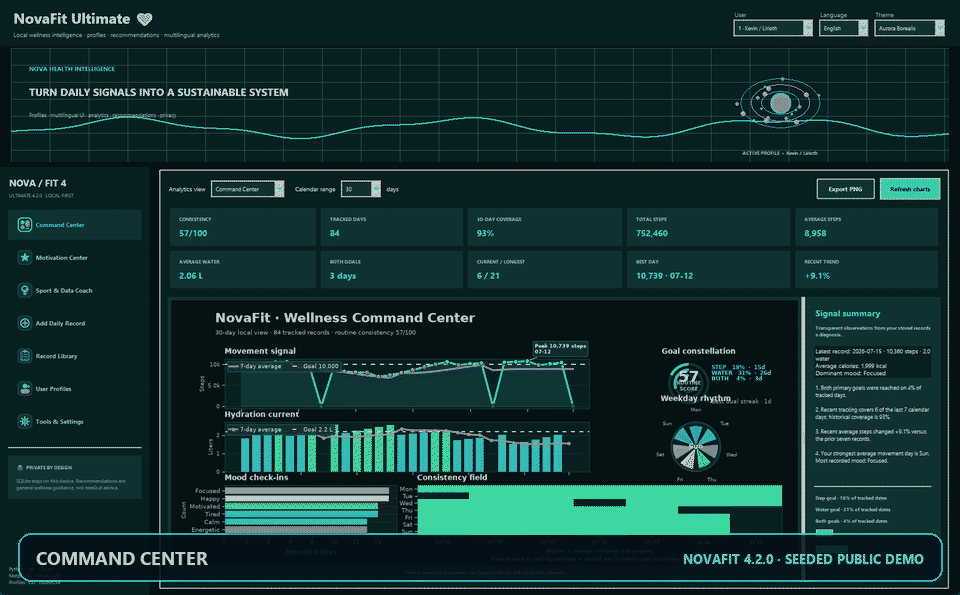
</picture>

**NovaFit 4.2.0 in motion:** A concise recruiter-facing desktop tour demonstrates navigation, motivation design, explainable coaching, profile isolation and multilingual RTL behavior; the static evidence below documents the analytics and twelve-theme system.

**Manifest-backed product summary:** A local-first Windows wellness intelligence studio with isolated profiles, English, Spanish and Hebrew RTL, efficient motion, explainable analytics, complete verified backups and one-click self-repair.

**Verified v4.2.0 evidence:** 124 discovered automated tests · 12 themes · 58 public visual assets · EN/ES/HE with Hebrew RTL · complete verified backups · installable static showcase · one-click Windows release.

<a href="./assets/analytics-training-atlas.png">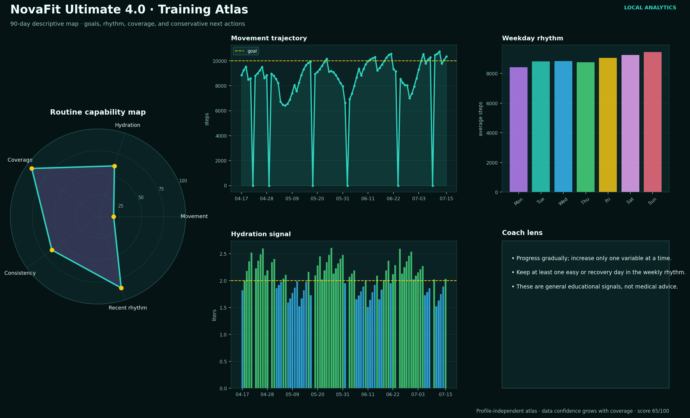</a>

The Training Atlas is profile-independent; the theme contact sheet uses seeded demonstration records without publishing a profile name.

**12 curated themes:** Midnight Neon · Aurora Borealis · Negev Sunrise · Ocean Depth · Forest Focus · Rose Quartz · Cloud Day · Solar Paper · High Contrast · Royal Sapphire · Cyber Lime · Sunset Arcade.

[Open the NovaFit live showcase](https://liriothteltanion.github.io/NovaFit/) · [Download the verified v4.2.0 release](https://github.com/LiriothTeltanion/NovaFit/releases/tag/v4.2.0) · [Inspect the NovaFit source](https://github.com/LiriothTeltanion/NovaFit) · [Verified project manifest](https://raw.githubusercontent.com/LiriothTeltanion/NovaFit/main/portfolio/project.json)

<strong>🌍 Open NovaFit profiles, EN/ES/HE, coach and safe delivery</strong>

> **Public-data boundary:** this system map contains no profile names, dates or wellness metrics.

<picture>
  <source media="(max-width: 640px)" srcset="./assets/novafit-trust-system-mobile.svg" />
  
</picture>

Each profile owns isolated records, goals, language, theme and activity preferences. English and Spanish use LTR; Hebrew moves the shell to RTL. Suggestions expose data confidence and reasons while avoiding medical claims.

The checker repairs a local `.venv`, validates Matplotlib and `Asia/Jerusalem`, runs 124 discovered automated tests, preserves an existing user database in workspace mode, and uses `VERIFY_ALL.bat` plus `python tools/package_audit.py --strict-distribution` for reproducible verification and clean downloadable releases.

### 👨‍🏫 Christopher Rodríguez Portfolio

**Status:** Client/collaboration case study · **Stack:** React · TypeScript · Vite · Tailwind CSS · Framer Motion 
**Problem → solution:** A real educator needed a maintainable bilingual professional presence. An accessible React and TypeScript portfolio with structured content, verification states, persistent themes and GitHub Pages delivery. 
**Evidence:** EN/ES content architecture, keyboard UX, reduced motion, SEO and automated deployment · **Role signal:** Client communication · accessible frontend · maintainable content architecture 
[Open Christopher Rodríguez Portfolio live demo](https://liriothteltanion.github.io/ChristopherRodriguezCVOnline/) · [Christopher Rodríguez Portfolio source](https://github.com/LiriothTeltanion/ChristopherRodriguezCVOnline)

### 📚 Fullstack2026

**Status:** Audited six-week learning archive · **Stack:** Python · JavaScript · TypeScript · Node.js · SQL 
**Problem → solution:** Course exercises need context, progression and reproducible quality checks. A structured archive from Python and OOP through JavaScript, DOM, async workflows, TypeScript, Node and databases. 
**Evidence:** Six curriculum weeks, 14 discoverable test files, CI, generated audits and transparently documented remaining quality gates · **Role signal:** Learning progression · problem solving · Git/PR discipline 
[Fullstack2026 source](https://github.com/LiriothTeltanion/Fullstack2026)

---

## 🧪 Engineering evidence

<picture>
  <source media="(max-width: 640px) and (prefers-reduced-motion: reduce)" srcset="./assets/engineering-orbit-mobile-static.svg" />
  <source media="(max-width: 640px)" srcset="./assets/engineering-orbit-mobile.svg" />
  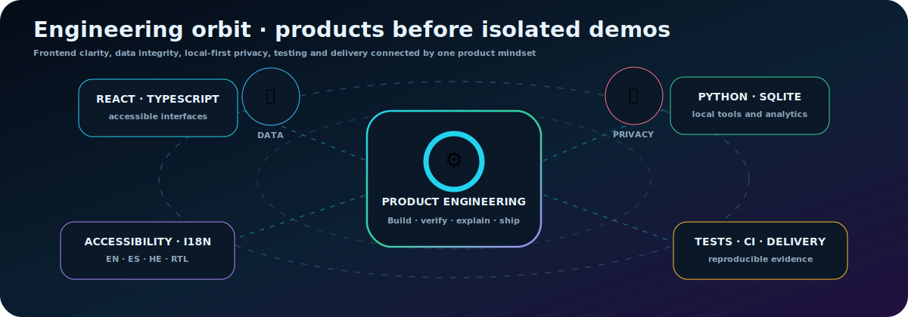
</picture>

> Evidence counts come from the featured public projects and their documented quality pipelines.

| Evidence across featured work | Count |
|---|---:|
| Featured products/case studies | **5** |
| React or TypeScript projects | **4** |
| Python evidence areas | **3** |
| Multilingual/accessibility projects (including RTL) | **4** |
| Automated quality pipelines | **4** |

### Core stack

**Languages:** TypeScript · JavaScript · Python · SQL 
**Frontend:** React · HTML5 · CSS3 · Tailwind CSS · Vite · Accessibility · i18n / RTL 
**Backend & data:** Node.js · Express fundamentals · REST APIs · SQLite · PostgreSQL · FastAPI · Alembic · JSON / CSV 
**Testing & quality:** Vitest · Testing Library · unittest · pytest · integration testing · structured logging · GitHub Actions · linting · data audits · bundle budgets 
**Workflow:** Git · GitHub · Docker · Conventional Commits · README-first documentation · AI-assisted review with explicit verification

---

## 🌍 Global communication

**Life route:** San Cristóbal, Venezuela → Beersheba, Israel

Country boundaries and deterministic tiny-state markers represent 195 sovereign states while framing a personal journey from Venezuelan roots to an Israeli home, supported by Spanish, English and Hebrew communication.

<picture>
  <source media="(max-width: 640px) and (prefers-reduced-motion: reduce)" srcset="./assets/world-globe-mobile-static.svg" />
  <source media="(max-width: 640px)" srcset="./assets/world-globe-mobile.svg" />
  <source media="(prefers-reduced-motion: reduce)" srcset="./assets/world-globe-static.svg" />
  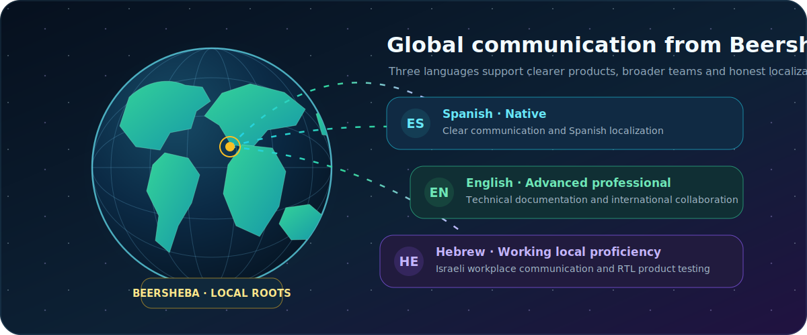
</picture>

| Language | Level | Product value |
|---|---|---|
| **Spanish** | Native | Clear communication and Spanish localization |
| **English** | Advanced professional | Technical documentation and international collaboration |
| **Hebrew** | Working local proficiency | Israeli workplace communication and RTL product testing |

---

## 🌱 Current growth focus

<picture>
  <source media="(max-width: 640px)" srcset="./assets/learning-roadmap-mobile.svg" />
  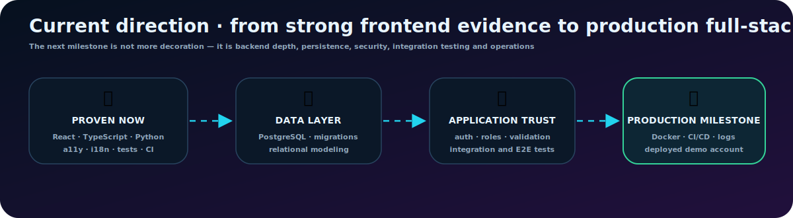
</picture>

**Next depth:** Production monitoring, service-level objectives and alert design · PostgreSQL backup, restore and migration drills · Authorization, OAuth and browser-level end-to-end testing · Free-tier deployment, capacity and cost operations

---

## 🧠 Engineering approach and strengths

### What I bring to a team

- Persistent debugging and practical troubleshooting
- Accessible multilingual product design, including RTL behavior
- Data transformation, validation and honest handling of uncertainty
- Clear technical documentation and visual product storytelling
- Local-first privacy decisions and proportional security claims
- Responsible early-adopter testing of preview and beta software in non-critical contexts, with reproducible feedback aimed at improving future releases

### Working principles

- Make the user-facing claim proportional to the evidence.
- Keep inputs validated and failure states actionable.
- Treat accessibility, privacy and documentation as implementation work.
- Prefer small reversible changes, focused commits and reproducible checks.
- Use AI to accelerate review and exploration without outsourcing understanding.

## 🎓 Education and structured learning

**Full-Stack Development — Developers Institute, Israel**  
2025–2026  
**Coverage:** Python, OOP, SQL, JavaScript, React, Redux, Node.js, Express, JWT, TypeScript, Git/GitHub and deployment.  
**Current status:** Completing and converting remaining coursework into tested, deployable portfolio evidence.

The public learning archive remains separate from production-ready projects so recruiters can distinguish progression from finished product evidence.

## 🧙‍♂️ Kevin and Lirioth

**Kevin** is the professional engineering identity: implementation, debugging, documentation, responsibility and collaboration.

**Lirioth Teltanion** is the creative signature: music technology, visual language, narrative systems, experimental interfaces and generative art.

Together, these identities make technically sound products easier to understand, remember and enjoy.

---

## 🤝 Contact

- 💼 [LinkedIn — Kevin Cusnir](https://www.linkedin.com/in/kevin-cusnir-883173b4/)
- 📄 [English CV](https://github.com/LiriothTeltanion/CV/blob/main/CV_EN.md) · [Currículum en español](https://github.com/LiriothTeltanion/CV/blob/main/CV_ES.md) · [קורות חיים בעברית](https://github.com/LiriothTeltanion/CV/blob/main/CV_HE.md)
- 🐙 [GitHub — Lirioth Teltanion](https://github.com/LiriothTeltanion)
- ✉️ [Email Kevin](mailto:kevincusnir@gmail.com)

<a href="#top">⬆️ Back to top</a>

<picture>
  <source media="(prefers-reduced-motion: reduce)" srcset="./assets/brand/kc-lt-signature.svg" />
  
</picture>

**Code with purpose. Design with personality. Data with honesty.** 💙

