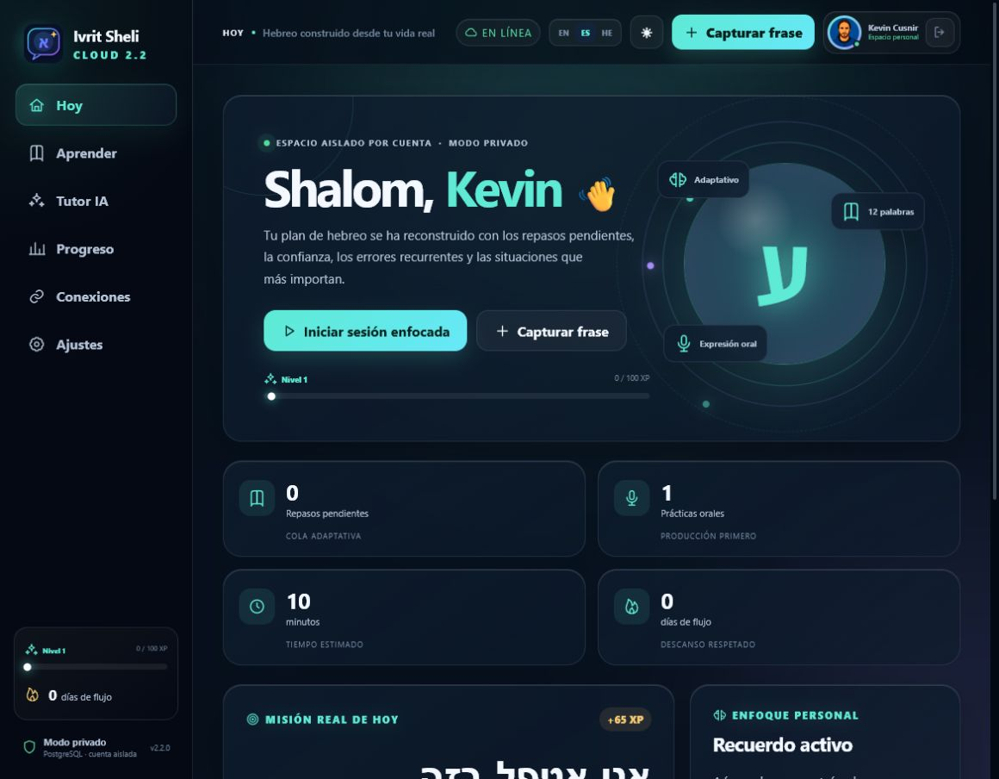
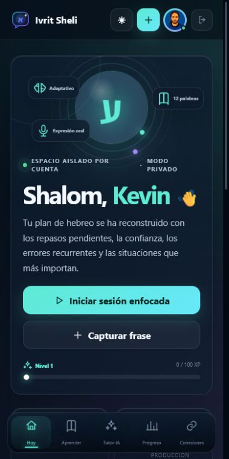
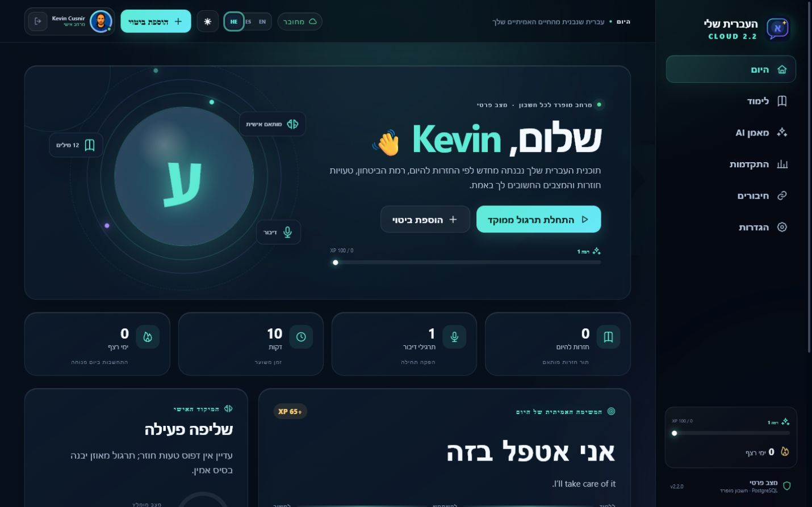
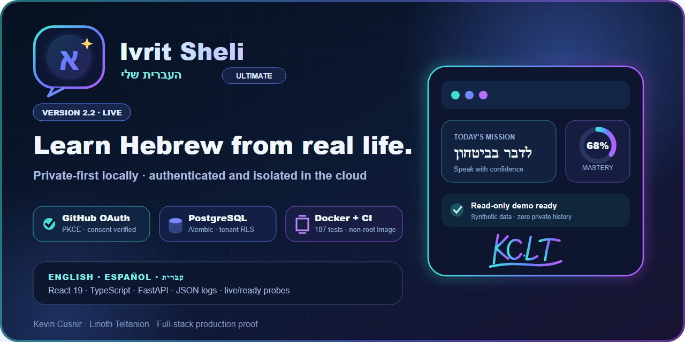

# Profile 2.4.0 visual report

Status: **released** · Published: **2026-07-18** · Public changes: **applied and verified**

## Outcome

Profile 2.4.0 replaces stale Ivrit Sheli media, sharply reduces animation
weight, prepares current social cards and coordinates independently versioned
visual upgrades across the CV, Fullstack2026 and Christopher Rodríguez
Portfolio. Nova Music Lab remains the first flagship and its working visual
story is intentionally preserved.

## Before and after

| Surface | Before | Profile 2.4.0 released |
| --- | --- | --- |
| Ivrit interface proof | Archived 2.1.x media | Sanitized live 2.2.0 desktop, 390 px mobile and Hebrew RTL captures at runtime build `66d68a3c44ac` over release baseline `c8c928661bdc` |
| Ivrit social card | 2.1 / 127 tests | 2.2 / 187 tests; OAuth wording limited to verified PKCE consent |
| Ivrit tour payload | 361,953 bytes | 301,410 bytes with current live frames |
| NovaFit tour payload | 3,914,571 bytes / 25 frames | 548,594 bytes / five deliberate scenes; same 960 x 595 canvas and nine-second runtime |
| CV | 1.0.0 text-first presentation | Published 1.1.0 with EN/ES/HE banner, reproducible 1280 x 640 social card and expanded verifier |
| Christopher portfolio | Placeholder share metadata | Published 1.1.0 with real desktop/mobile/teaching captures, accessible tour, canonical metadata and successful Pages deployment |
| Fullstack2026 | `.github/README.md` could hide the real cover | Published 1.1.1 with root cover restored, regression tests, clean Prettier/quality gates and zero known dependency vulnerabilities |
| Fourth GitHub social slot | Empty | Verified public Exophase `LiriothTeltanion` link applied and persisted after reload |

## Current Ivrit visual proof

## Current share card

## Performance-aware motion

Both animated tours keep static fallbacks for narrow screens and reduced-motion
preferences. The generated profile remains within its referenced visual-payload
budget.

## Editorial readiness scores

These are qualitative portfolio-review scores, not external certifications.

| Area | Score | Evidence / remaining constraint |
| --- | ---: | --- |
| Recruiter clarity | 97/100 | Role, location, stack and strongest products remain visible quickly |
| Visual identity | 98/100 | Responsive banner, portrait, globe and KC star LT signature remain coherent |
| Current project proof | 98/100 | Three current product stories plus published CV/client/learning releases |
| Animation and performance | 97/100 | NovaFit is 85.99% lighter; static and reduced-motion paths remain |
| Evidence honesty | 98/100 | Exact tests, deployment commit, privacy boundary and OAuth limitation are explicit |
| Multilingual accessibility | 97/100 | English, Spanish and Hebrew facts agree; mobile and RTL evidence is current |
| Release engineering | 99/100 | Exact commits, annotated tags, GitHub Releases, Pages and forward security correction verified |
| Public metadata | 99/100 | Four real social links, seven About panels and seven current cards are applied |
| Learning-archive hygiene | 88/100 | Fullstack Prettier passes and lint improved 174 → 65; 65 semantic findings remain documented |

## Honest remaining work

1. Resolve Fullstack2026's remaining 65 semantic ESLint findings exercise by
   exercise; tests, formatting, the strict quality gate and dependency audit
   already pass.
2. Preserve Ivrit's dual provenance: reviewed release baseline plus observed
   runtime build. Any future application or runtime change under the same
   version must trigger explicit evidence review rather than silent regression.
3. Complete Ivrit's final OAuth code exchange, authenticated refresh and logout
   browser E2E checks before upgrading those claims.

No secret, private study history, wellness history, credential, token or private
browser state is included in this release.
